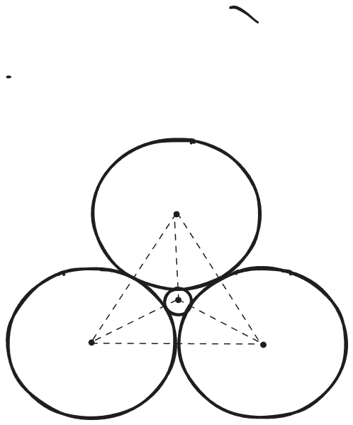
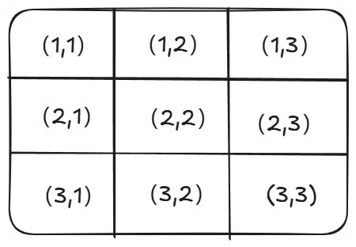
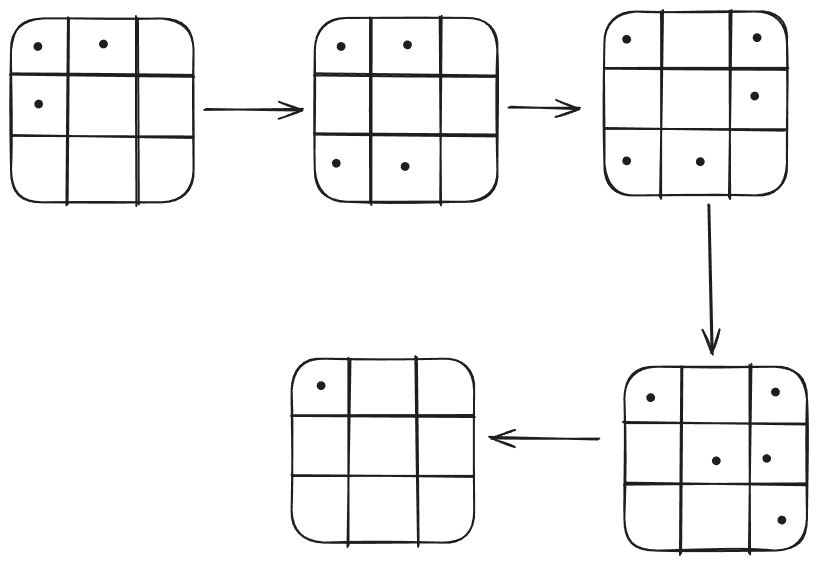

<h1>集萃_2 </h1> 

## 题1

小猴子吃桃子，一共有 $n$ 个桃子，每两天至少吃一个，他要在一开始作出规划，则不同的规划方式有 $\underline{}\underline{}\underline{}\underline{}\underline{}\underline{}$种。

> 答案：$2*3^{n-1}$

------------------------------

**解析：**

​	设有 *n* 个桃子时，一共有 $p_n$ 种不同的规划方式，我们考虑 $p_{n+1}$ ：吃完了 $n$ 个桃子之后，假设第 $n$ 个桃子是在第 $k$ 天吃的，那么剩下的第 $n+1$ 个桃子可以在第 $k$ 天、第 $k+1$ 天、第 $k+2$ 天吃，也就是说
$$
p_{n+1} = 3 \times p_n
$$
​	只有一个桃子时，猴子可以在第一天或者第二天吃，所以 $p_1=2$ ，从而 $p_n=2*3^{n-1}$ 。

## 题2

某数学兴趣小组探究二项分布的性质。设随机变量 $X$~$B(n,p),n\in\mathbb{N}^*,0<p<1$ 。

(1) 用 $[x]$ 表示不超过 $x$ 的最大整数，求正整数 $N$ ，使得 $P(X=N)$ 最大。

(2) 为了探究二项分布的数学期望和方差公式，设随机变量 $Y$ 的分布为 $P(Y=k)=p_k(k=1,2,3,\cdot\cdot\cdot n)$ ，函数 $f(x)=p_1x+p_2x^2+p_3x^3+\cdot\cdot\cdot p_nx^n$ ，$f(x)$ 的导函数为 $f’(x)$ ，$f'(x)$ 的导函数为 $f''(x)$ 。 

(i) 证明：$E(Y)=f'(1),D(Y)=f''(1)+f'(1)-[f'(1)]^2$ 。

(ii) 利用(i)的结果，求 $E(X)$ 和 $D(X)$ 。

---------------------------------------------------------

**解析：**

​	这道题并不难，留给读者自行解决。本题中的函数 $f(x)$ 称为**母函数**，第(2)问就是利用母函数求解概率分布的期望和方差。感兴趣可以上网查阅母函数的相关资料。

## 题3

设 $f(x)=ax^3+bx^2+cx+d$ ，其中 $a \neq 0$ 且 $a,b,c,d \in \mathbb{Z}$ 。若 $|f(\frac{1}{2})|,|f(\frac{1}{3}|,|f(\frac{1}{4})|$ 均小于 $\frac{1}{2024}$ ，则 $f(1)$ 的值可能为(  )

$A.$ 4    $B.$ 6    $C.$ 9    $D.$ 10  

>  答案：$B$

------------------------

**解析：**
$$
|f(\frac{1}{2})|=\frac{|a+2b+4c+8d|}{8}\\
|f(\frac{1}{3})|=\frac{|a+3b+9c+27d|}{27}\\
|f(\frac{1}{4})|=\frac{|a+4b+16c+64d|}{64}\\
$$
​	如果 $f(\frac{1}{2}) \neq 0$ ，由于 $a+2b+4c+8d$ 是个整数，故 $|f(\frac{1}{2})| \geq \frac{1}{8}$ ，这与条件相矛盾，所以 $f(\frac{1}{2})=0$ 。同理可得 $f(\frac{1}{3}) = f(\frac{1}{4}) = 0$ ，从而三次函数 $f(x)$ 的三个零点就是 $\frac{1}{2},\frac{1}{3},\frac{1}{4}$ 。故
$$
\left\{
\begin{align*}
a+2b+4c+8d&=0\\
a+3b+9c+27d&=0\\
a+4b+16c+64d&=0
\end{align*}
\right.
$$
​	解得 $a=-24d,b=26d,c=-9d$ ，所以 $f(1)=a+b+c+d=-6d$ ，它一定是 $6$ 的倍数。

## 题4

某同学在课外阅读中了解到**笛卡尔定理**：若四个圆两两外切，半径分别为 $r_1,r_2,r_3,r_4$ ，则 $(\frac{1}{r_1}+\frac{1}{r_2}+\frac{1}{r_3}+\frac{1}{r_4})^2 = \lambda(\frac{1}{r_1^2}+\frac{1}{r_2^2}+\frac{1}{r_3^2}+\frac{1}{r_4^2})$ 。由于记忆模糊，该同学忘记了 $\lambda$ 的值。

根据所学知识，推测 $\lambda=$ (  )

$A.$ 2   $B.$ $\sqrt{3}$   $C.$ 3   $D.$  4

> 答案：$A$

---------------------------------------

**解析：**

​	直接取一个最特殊的情况，如下图所示：

​	

​	不妨设 $r_1=r_2=r_3=1$ ，由对称性知道外面三个圆的圆心构成一个等边三角形，而中间小圆的圆心恰好是等边三角形的中心。容易解出 $r_4$ ，再把这些半径的值代入$(\frac{1}{r_1}+\frac{1}{r_2}+\frac{1}{r_3}+\frac{1}{r_4})^2 = \lambda(\frac{1}{r_1^2}+\frac{1}{r_2^2}+\frac{1}{r_3^2}+\frac{1}{r_4^2})$ 即可求出 $\lambda=2$ 。

## 题5

设函数 $f(x)=x^a+a^x$ ，$a>0$ 且 $a\neq 1$ ,$x>0$ 。

(1) 若 $a=\frac{1}{e}$ ，讨论 $f(x)$ 的单调性。

(2) 证明： $f(x)>1$ 。

----------------------------------------------------------

**解析：**

本题是一道经典问题。

(1)	比较简单。

(2)	要证明
$$
x^a + a^x>1
$$
​	注意到，当 $x>1$ 或者 $a>1$ 时，上式显然成立。

​	下面考虑 $0<x<1,0<a<1$ 的情况。我们先证明一个引理：

> 引理: 若 $x>-1,0<a<1$ ，则
> $$
> (1+x)^a < 1+ax
> $$
> ​     若 $x>-1,a>1$ ，则
> $$
> (1+x)^a > 1+ax
> $$
> 证明： 设 $f(x)=(1+x)^a-1-ax$ ，其中 $x>-1,0<a<1$ 。
>
> ​      则 $f’(x)=a[(1+x)^{a-1}-1]$ ，易见 $x=0$ 就是 $f(x)$ 的最大值点（取不到），所以 	         $f(x) < f(0)=0$ ，即
> $$
> (1+x)^a < 1+ax
> $$
> ​      如果 $a>1$ ，与上面的证明类似，也可得到 
> $$
> (1+x)^a > 1+ax
> $$
> ​      **证毕!**

​	上面的引理，称为**伯努利不等式**。在2015年以前，也就是全国卷尚未普及，地方卷盛行的时候，很多省份的高考都出过以伯努利不等式为背景的导数题，尤其是湖北卷，曾经考过两次。

​	回到本题
$$
x^a+a^x=\frac{1}{x^{-a}}+\frac{1}{a^{-x}}\\
\quad\quad\quad\quad=\frac{x}{x^{1-a}}+\frac{a}{a^{1-x}}\\
\quad\quad\quad\quad\quad\quad\quad\quad\quad\quad\quad\quad=\frac{x}{(1+x-1)^{1-a}}+\frac{a}{(1+a-1)^{1-x}}\\
\quad\quad\quad\quad\quad\quad\quad\quad\quad\quad\quad\quad\quad\quad\quad> \frac{x}{1+(x-1)(1-a)}+\frac{a}{1+(a-1)(1-x)}\\
\quad\quad\quad\quad\quad\quad\quad\quad\quad=\frac{x}{a+x-ax}+\frac{a}{a+x-ax}\\
\quad\quad\quad\quad\quad\quad> \frac{x}{a+x}+\frac{a}{a+x}=1
$$
​	你可能对上面的过程有疑问：为什么这么做？理由是什么？我会一一解释

> 为什么要把 $x^a$ 和 $a^x$ 变成倒数？

​	因为如果直接对原来的式子用伯努利不等式：
$$
x^a+a^x = (1+x-1)^a+(1+a-1)^x < 1+a(x-1)+1+x(a-1)
$$
​	你会发现不等号是反的。而如果把 $x^a$ 和 $a^x$ 倒过来，在分母上用不等式，那么不等号的方向就对了。

> 为什么把 $x^a$ 和 $a^x$ 变成倒数之后还要在分子分母上同时乘以 $x$ 和 $a$ ?

​	如果不这样做，那么指数就是负数，而我们上面的证明的引理**伯努利不等式**中，没有指数是负数的情况（尽管伯努利不等式在指数为负的时候也成立，但不常用）。我们在分子分母上同时乘以 $x$ 和 $a$ 之后，指数就变成了 $1-a$ 和 $1-x$ ，它们都位于 $(0,1)$ ,对应的伯努利不等式的不等号方向是 $<$ ，又因为在分母上，再倒一下就是 $>$ 了，与我们题目要求的结论是一致的。

​	当然，你可能还有个更加难以回答的问题：

> 如果我不知道伯努利不等式，这题怎么做？就算我知道伯努利不等式，又怎么会想到用它？

​	没有伯努利不等式，这题恐怕是难以下手的。而就算你知道伯努利不等式，如果没有命题人的暗示，也确实很难想到使用它。其实，伯努利不等式的特点就是把指数给“拿了下来”。能理解这一点的话，或许下次遇到类似的题目可以试试伯努利不等式。

​	数学就是这样，直觉和运气在解题时也很重要。

## 题6

实数 $a,b$ 满足 $a^2+b^2=1$ ，则 $\frac{1}{a+2}+\frac{1}{b+2}$ 的最大值为 $\underline{}\underline{}\underline{}\underline{}\underline{}$

> 答案: $\frac{\sqrt{7}+2}{3}$

------------------------------------------------------------------------------

**解析：**

​	这是一个代数不等式的问题。遇到条件 $a^2+b^2=1$ ，一般都要使用三角换元：
$$
\left\{
\begin{align*}
a &= \cos{\theta}\\
b &= \sin{\theta}
\end{align*}
\right.
$$
​	其中 $\theta \in [0,2\pi]$ 。于是我们有
$$
\begin{align*}
	\frac{1}{a+2}+\frac{1}{b+2} &= \frac{1}{\cos{\theta}+2}+\frac{1}{\sin{\theta+2}}\\
	&=\frac{\sin{\theta+\cos{\theta}}+4}{\sin{\theta}\cos{\theta}+2(\sin{\theta}+\cos{\theta})+4}
\end{align*}
$$
​	在三角函数一章，我们学过：当一个式子里出现 $\sin{\theta}+\cos{\theta}$ 和 $\sin{\theta}\cos{\theta}$ 的时候，可以作换元 $t=\sin{\theta}+\cos{\theta} \in [-\sqrt{2},\sqrt{2}]$ ,则 $\sin{\theta}\cos{\theta}=\frac{t^2-1}{2}$ 。

​	于是有
$$
\begin{align*}
\frac{1}{a+2}+\frac{1}{b+2} &= \frac{t+4}{\frac{t^2-1}{2}+2t+4}\\
&= \frac{2(t+4)}{t^2+4t+7} \\
&= \frac{2(t+4)}{(t+4-4)^2+4(t+4-4)+7}\\
&= \frac{2(t+4)}{(t+4)^2-4(t+4)+7}\\
&=\frac{2}{t+4+\frac{7}{t+4}-4}\\
&\leq \frac{2}{2\sqrt{7}-4}\\
&=\frac{\sqrt{7}+2}{3}
\end{align*}
$$
​	本题的有趣之处在于，这个不等式取最大值的时候，$a$ 和 $b$ 不是相等的（尽管 $a$ 和 $b$ 的地位是完全等价的）。

##  题7

已知数列 $\{a_n\}$ 的各项均为正数，设 $b_n=\frac{a_{n+1}}{a_n}$ ， $c_n=a_na_{n+1}$ 。若对于任意正整数 $n$ ，都有

$b_{n+1} \geq b_n$ ，$c_nc_{n+2}=c_{n+1}^2$ ，证明：$a_n$ 是等比数列。

-------------------------------------------------------------

**解析：**

​	这道题非常让人印象深刻。

​	首先根据两个条件，我们有
$$
\begin{align}
\frac{a_{n+2}}{a_{n+1}} &\geq \frac{a_{n+1}}{a_n}\\
a_na_{n+3}&=a_{n+1}a_{n+2}
\end{align}
$$
​	我们要证明 $a_n$ 是等比数列，也就是证明 $\frac{a_{n+2}}{a_{n+1}}=\frac{a_{n+1}}{a_n}$ 。

​	根据(2)，我们有
$$
\frac{a_{n+3}}{a_{n+2}} = \frac{a_{n+1}}{a_n}
$$
​	而根据(1)，我们有
$$
\frac{a_{n+3}}{a_{n+2}} \geq \frac{a_{n+2}}{a_{n+1}}\geq\frac{a_{n+1}}{a_n}
$$
​	所以只能是
$$
\frac{a_{n+3}}{a_{n+2}}=\frac{a_{n+2}}{a_{n+1}}=\frac{a_{n+1}}{a_n}
$$
​	从而 $\{a_n\}$ 是等比数列。

## 题8

已知数列 $\{a_n\}$ 的各项均为正数，设 $b_n=\frac{a_{n+2}}{a_n}$ ， $c_n=a_na_{n+1}a_{n+2}$ 。若对于任意正整数 $n$ ，都有

$b_{n+1} \geq b_n$ ，$c_nc_{n+2}=c_{n+1}^2$ ，证明：$a_n$ 是等比数列。

> 这道题的思路与上面的题7是一样的，留给读者作为练习。

## 题9

(2023年四省联考)下图是一个开关阵列，每个开关只有“开”和“关”两种状态，按其中的一个开关1次，将导致自身和所有相邻的开关改变状态。例如，按 $(2,2)$ 将导致 $(1,2),(2,1),(2,2),(2,3),(3,2)$ 改变状态。如果要求只改变 $(1,1)$ 的状态，则需按开关的最少次数为 $\underline{}\underline{}\underline{}\underline{}\underline{}\underline{}$

**解析：**

​	这道题像是一个益智游戏，当时四省联考把这题作为填空压轴，引起了很多争议。

​	规则很简单。根据这个规则，我们可以总结几点：

> 按开关的顺序，不影响最终的结果。

​	大家可以自行验证看看。你会发现只要确定了哪些开关会被按下，那么无论以什么顺序来按，结果都是一样的。所以这个题目的答案肯定不止一种。

> 每个开关要么不按，要么只按一次。

​	因为如果重复按了一个开关2次、4次、6次……相当于没有按。按了3次、5次、7次……就相当于只按了一次。那有人肯定要问了：如果我不是一股脑地按很多次，而是先按一次这个开关，再按一次另一个开关，然后再返回来按这个开关呢？别忘了，刚才说过顺序是不影响的，你间断地重复按一个开关和一次性按很多次是没区别的。

> 要按动的开关一定关于对角线(1,1),(2,2),(3,3)对称

​	这也很好理解。因为我们最终要得到的状态是只有(1,1)亮起，你会发现这个图形是关于左上到右下的对角线对称的。如果你在左下方按了一个开关，而没有在右上方对称的位置按开关，那么最终的结果一定不会关于对角线对称。

​	

​	