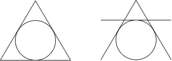

 <h1>       集萃_1                 </h1> 

## 题1

> *类型：组合数学*

---------------------

​	定义：三维欧氏空间中的点称为整点，当且仅当x,y,z坐标都是整数，例如(1,1,2)，(-2,6,-2)。从空间中任取$n$个整点

$P_1,P_2,P_3,...P_n$，再从它们之中任取两个不同的点$P_i,P_j(i \neq j)$，$P_i,P_j$的中点**不会**是整点。问：$n$的最大值为$\underline{}\underline{}\underline{}\underline{}\underline{}$

> 答案：8

**解答：**

​	 如果两个整点的中点还是整点，说明$x,y,z$坐标的奇偶性相同（因为奇加奇得偶，偶加偶得偶，而偶数除以二一定是整

 数）。$x,y,z$的奇偶性一共能组合出$8$种情况：(奇，奇，奇)，(奇，偶，奇)，(偶，奇，奇)，(奇，奇，偶)，(奇，偶，

偶)，(偶，偶，奇)，(偶，奇，偶)，(偶，偶，偶)。那么$n>8$时，也就是任取空间中至少$9$个整点时，其中必然存在两个

整点的奇偶性相同，从而它们两个的中点也是整点。现在题目要求所有的中点都不能是整点，所以$n$最大为$8$(也就是取遍

了所有奇偶性的组合)。

## 题2

> 类型：直线与圆

​	平面直角坐标系中有三条直线:$l_1:\cos{\theta_1} \cdot x + \sin{\theta_1} \cdot y = 1,l_2:\cos{\theta_2} \cdot x + \sin{\theta_2} \cdot y = 1,l_3:\cos{\theta_3} \cdot x + \sin{\theta_3} \cdot y = 1 $，其中$\theta_1 \neq \theta_2 \neq \theta_3$。若$l_1,l_2,l_3$围成一个等边三角形，其面积为$S$，则$S$的取值集合为$\underline{}\underline{}\underline{}\underline{}\underline{}$

> 答案：{$\frac{\sqrt{3}}{3},3\sqrt{3}$}

**解答：**

​	观察三条直线的结构，容易注意到它们到原点的距离都为1。所以，它们都是单位圆的切线。又因为围成了等边三角形，所以有两种情形：要么单位圆作为等边三角形的内切圆，要么单位圆作为等边三角形的**外切圆**(注意不是外接圆)。如下图所示：

