
<h1>专题练习_圆锥曲线_1</h1> 

## 题1

椭圆 $\frac{x^2}{a^2}+\frac{y^2}{b^2}=1(a,b>0)$ 的一个焦点到右顶点 $(a,0)$ 的距离为 $3c$ ( $c$ 是半焦距)，则该椭圆的离心率为___

> 答案：$\frac{1}{4}$ 或 $\frac{1}{3}$ 或 $\frac{1}{2}$

--------------------------------------------------------

**解析：**

​	本题容易因为粗心而漏解。注意题干中没有指明 $a,b$ 间的大小关系，所以要分两种情况讨论。

- 当 $a>b$ 时，椭圆的两个焦点为 $(-c,0),(c,0)$ 。这两个焦点到右顶点 $(a,0)$ 的距离是不一样的，所以这里能得出两种解。
- 当 $a<b$ 时，椭圆的两个焦点为 $(0,c),(0,-c)$ 。这两个焦点到右顶点 $(a,0)$ 的距离相等，所以这里只有一种解。

## 题2

过点 $M(1,1)$ 作斜率为 $-\frac{1}{2}$ 的直线与椭圆 $C:\frac{x^2}{a^2}+\frac{y^2}{b^2}=1(a>b>0)$ 相交于 $A,B$ 两点，若 $M$ 是线段 $AB$ 的中点，则椭圆 $C$ 的离心率等于 $\underline{}\underline{}\underline{}\underline{}\underline{}\underline{}$

> 答案：$\frac{\sqrt{2}}{2}$

----------------------------------

**解析：**

​	常规方法是使用点差法。这里介绍三个个**二级结论**：

> 在椭圆 $C:\frac{x^2}{a^2}+\frac{y^2}{b^2}=1(a>0,b>0)$ 中，$AB$ 是一条直径（即 $AB$ 经过椭圆中心），$C$ 是椭圆上任意一点，则直线 $AC$ 的斜率 $k_1$ 和直线 $BC$ 的斜率 $k_2$ 满足关系：
> $$
> k_1k_2=e^2-1
> $$
> 其中 $e$ 是椭圆的离心率。
>
> 

​	这是一个重要的结论，揭示了椭圆的本征。我们知道，如果上面不是椭圆，而是一个圆，那么无论何时都有 $k_1k_2=-1$ 。这是因为圆的离心率是 $e=0$ ，所以 $k_1k_2=0^2-1=-1$ 。而椭圆可以看做圆的推广，圆可以看做椭圆的特殊情形，所以 $k_1k_2=e^2-1$ 这个结论就是“直径所对的圆周角是九十度”这一性质在椭圆中的推广。

​	圆的性质有很多。除了上面这个，还有没有其他的性质可以推广到椭圆中呢？

​	下面再列举几个，大家想想它们对应圆中的哪些性质？

> 在椭圆 $C:\frac{x^2}{a^2}+\frac{y^2}{b^2}=1(a>0,b>0)$ 中， $O$ 是椭圆中心， $AB$ 是一条弦， $C$ 是 $AB$ 中点，则直线 $AB$ 的斜率 $k_1$ 和直线 $OC$ 的斜率 $k_2$ 满足关系：
> $$
> k_1k_2=e^2-1
> $$
> 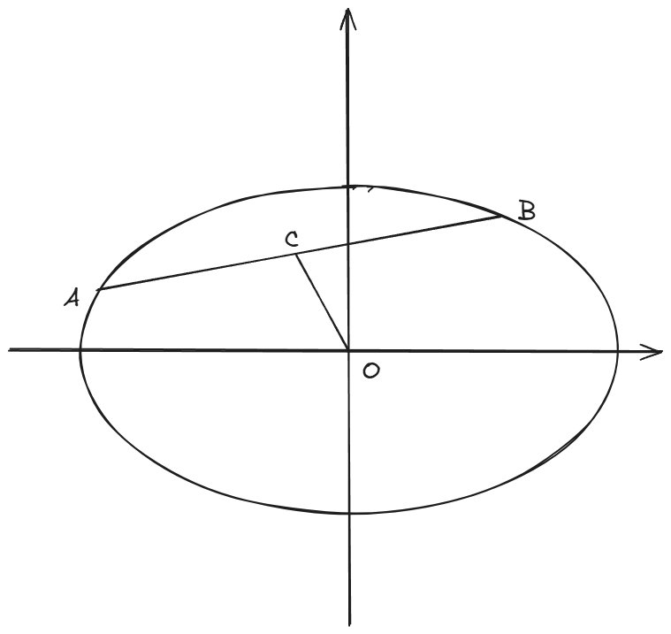

​	不难看出，上面这个性质对应的是圆中的**垂径定理**。因此上面这个公式也叫做**椭圆的垂径定理**。

> 在椭圆 $C:\frac{x^2}{a^2}+\frac{y^2}{b^2}=1(a>0,b>0)$ 中， $O$ 是椭圆中心， 直线 $l$ 是椭圆的一条切线，切点为 $P$ ，则直线 $OP$ 的斜率 $k_1$ 和直线 $l$ 的斜率 $k_2$ 满足关系：
> $$
> k_1k_2=e^2-1
> $$
> 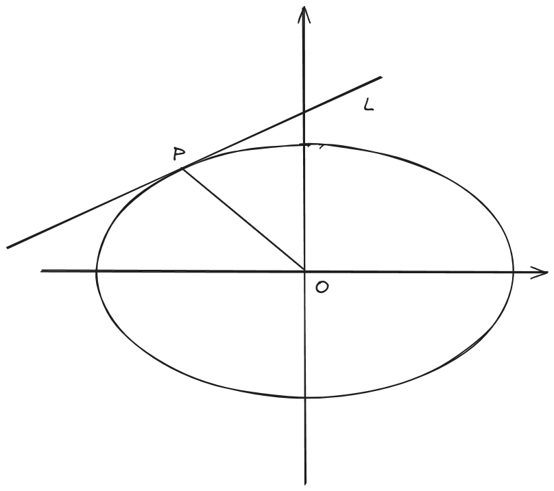

​	不难看出，上面这个性质对应的是“圆心与切点的连线垂直于切线”。

​	这三个结论，公式的形式完全一样。请牢牢记住，它们在很多题目中都有应用，属于是圆锥曲线的众多二级结论中最为基础的三个。

​	回到本题，我们可以利用上面的第二个结论，就有 $-\frac{1}{2} \times 1 = e^2-1$ ，则 $e=\frac{\sqrt{2}}{2}$ 。

## 题3

椭圆 $C:\frac{x^2}{2}+y^2=1$ 的一条切线 $l$ 分别于 $x$ 轴和 $y$ 轴交于 $A,B$ 两点， $O$ 为坐标原点，则三角形 $OAB$ 的面积的最小值为 $\underline{}\underline{}\underline{}\underline{}\underline{}\underline{}$

> 答案： $\sqrt{2}$

---------------------------------

**解析:**

​	在这里要补充一个知识，就是所谓的“极点、极线”。很多圆锥曲线题的命题背景都是极点极线。

​	极点、极线是射影几何中的概念。

> 坐标平面内有椭圆 $C:\frac{x^2}{a^2}+\frac{y^2}{b^2}=1(a,b>0)$ ，点 $P(x_0,y_0)$ 和直线 $l:\frac{x_0x}{a^2}+\frac{y_0y}{b^2}=1$ ，则称 $P$ 是 $l$ 对 $C$ 的极点，$l$ 是 $P$ 对 $C$ 的极线。

​	关于极点、极线，存在数不胜数的性质和定理。你遇到的任何一道圆锥曲线大题都很有可能就是以这些性质和定理为背景的。我们列举几个常见的：

> 1. 当极点位于圆锥曲线上，极线就是极点处的切线。
>
> 2. 当极点位于圆锥曲线外，极线就是极点的切点弦。
>
> 3. 当极点位于圆锥曲线内，极线就位于圆锥曲线外。

​	这三条性质，按照题目中的出现频率来分，是1>2>3。第1条性质经常使用，它直接给出了圆锥曲线(不仅仅是椭圆和圆)的切线方程。

​	例如在本题中，我们设椭圆上一点 $(x_0,y_0)$ ,则这一点处的切线就是 $\frac{x_0x}{2}+y_0y=1$ ，它与两条坐标轴的交点分别为 $(\frac{2}{x_0},0),(0,\frac{1}{y_0})$ ，从而所求的三角形面积就是
$$
S=\frac{1}{x_0y_0}
$$
​	由于 $(x_0,y_0)$ 在椭圆上(也就是极点在椭圆上)，所以它的坐标满足椭圆方程： 
$$
\frac{x_0^2}{2}+y_0^2=1 \geq \sqrt{2}x_0y_0
$$
​	推出 $x_0y_0 \leq \frac{\sqrt{2}}{2}$ ，因此 $S \geq \sqrt{2}$ 。

## 题4

设 $F_1,F_2$ 分别为椭圆 $\frac{x^2}{3}+y^2=1$ 的左、右焦点，点 $A,B$ 在椭圆上，若 $\overrightarrow{F_1A}=5\overrightarrow{F_2B}$ ，则点 $A$ 的坐标是 $\underline{}\underline{}\underline{}\underline{}\underline{}\underline{}$

> 答案 $(0,\pm1)$

---------------------------------

**解析：**

​	这是浙江卷的一道经典之作。这道题有四种方法：

- 暴力法

	​    首先画出本题的图像：

  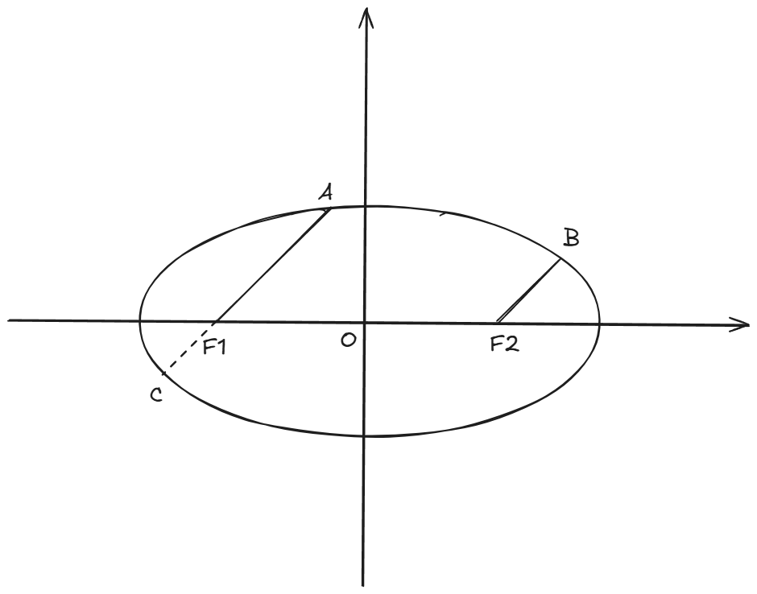

  ​	根据椭圆的对称性，我们可以把线段 $F_2B$ 平移到 $F_1C$ 的位置。然后设 $A(x_1,y_1),C(x_2,y_2)$ 。不难得到点 $F_1$ 的坐标为 $(-\sqrt{2},0)$ 。
  
  ​	设直线 $AC$ 的方程为 $y=k(x+\sqrt{2})$ 。联立直线和椭圆：
  $$
  \left\{
  \begin{align*}
  y=k(x+\sqrt{2})\\
  \frac{x^2}{3}+y^2=1
  \end{align*}
  \right.
  $$
  ​	得到 $(1+3k^2)x^2+6\sqrt{2}k^2x+6k^2-3=0$ 。根据韦达定理就有 $x_1+x_2=-\frac{6\sqrt{2}k^2}{1+3k^2}$ ，$x_1x_2=\frac{6k^2-3}{1+3k^2}$ 。又由条件 $\overrightarrow{F_1A}=5\overrightarrow{F_2B}$ ,可得 $x_1+5x_2=-6\sqrt{2}$ ，$y_1+5y_2=0$ 。根据这些方程就可以求出 $x_1=0$ 。所以点 $A$ 位于椭圆的上顶点或者下顶点，即 $(0,\pm 1)$。
  
- 定比点差法

​	大家对点差法不陌生，但是点差法只能处理二等分弦的问题，而本题是六等分弦，所以要对点差法改进一下。
$$
\left\{
\begin{align}
\frac{x_1^2}{3}+y_1^2&=1\\
\frac{x_2^2}{3}+y_2^2&=1
\end{align}
\right.
$$
​	正常的点差法就是用(1)-(2)，得到
$$
\frac{\frac{y_1+y_2}{2}}{\frac{x_1+x_2}{2}} \cdot \frac{y_1-y_2}{x_1-x_2}=-\frac{1}{3}
$$
​	上面左边式子的第一项也就是 $AC$ 中点与原点连线的斜率，但是我们这个题目中， $F_1$ 并不是 $AC$ 中点，而是 $AC$ 的六等分点，根据我们在平面向量中学过的**定比分点公式**，它的坐标应该是 $(\frac{x_1+5x_2}{6},\frac{y_1+5y_2}{6})$。怎么改进我们的点差法呢？这样做，我们把(2)式乘以 $5$ 的平方 $25$ 。好好体会下面的过程，你应该能理解这么做的理由。
$$
\left\{
\begin{align}
\frac{x_1^2}{3}+y_1^2&=1\\
\frac{(5x_2)^2}{3}+(5y_2)^2&=25
\end{align}
\right.
\\\\
$$
​	(3)-(4)，我们有：
$$
\begin{align*}
\frac{(x_1-5x_2)(x_1+5x_2)}{3}+(y_1-5y_2)(y_1+5y_2)&=-24

\end{align*}
$$
​	前面说过 $F_1$ 的坐标是 $(\frac{x_1+5x_2}{6},\frac{y_1+5y_2}{6})$ ，而它作为左焦点，坐标是已知的，也就是 $(-c,0)$ ，即 $(-\sqrt{2},0)$ ，所以 $x_1+5x_2=-6\sqrt{2},y_1+5y_2=0$ ，代入上面的式子中，我们有：
$$
x_1-5x_2=6\sqrt{2}
$$
​	结合 $x_1+5x_2=-6\sqrt{2}$ 就可以求出 $x_1=0$ ，从而点 $A$ 就是椭圆的上顶点或者下顶点，也就是 $(0,\pm 1)$ 。 

​	这就是定比点差法，聪明的你想必已经领悟了其中奥妙。

- 焦半径公式法

​	首先要介绍什么是**焦半径公式:**

> 椭圆 $\frac{x^2}{a^2}+\frac{y^2}{b^2}=1$ ，左、右焦点分别为 $F_1,F_2$ ，椭圆上一点 $A(x_0,y_0)$ ，则：
> $$
> |AF_1|=a+ex_1\\
> |AF_2|=a-ex_2
> $$

​	证明很简单，利用两点间的距离公式计算然后化简即可。这个焦半径公式说明了椭圆上的点到焦点的距离是非常容易计算出来的，只需要知道椭圆的长短轴以及点的横坐标即可。

​	回到本题，根据焦半径公式，有
$$
|AF_1|=\sqrt{3}+\frac{\sqrt{6}}{3}x_1\\
|CF_1|=\sqrt{3}+\frac{\sqrt{6}}{3}x_2\\
$$
​	由于 $|AF_1|=5|CF_1|$ ,所以 $\sqrt{3}+\frac{\sqrt{6}}{3}x_1=5\sqrt{3}+\frac{5\sqrt{6}}{3}x_2$ ，化简后得到 $x_1-5x_2=6\sqrt{2}$ ，是不是与前面定比点差法得到的结论是一样的？同样结合 $x_1+5x_2=-6\sqrt{2}$ 就求出了 $x_1=0$ 。

- 直线的参数方程

​	在我们人教版教材的“拓展阅读”中（忘了是选修一还是必修二），介绍了直线的参数方程。（下面我对参数方程的讲解不会很细致，如果没弄明白就去看教材）

​	参数方程这个名词应该是不陌生的，我们在“直线与圆”一章已经学习过圆 $x^2+y^2=r^2$ 的参数方程：
$$
\left\{
\begin{align*}
x&=r\sin{\theta}\\
y&=r\cos{\theta}
\end{align*}
\right.
$$
​	其中 $r$ 和 $\theta$ 的含义你是否清楚？ $r$ 就是圆的半径，是个定值； $\theta$ 就是圆上一点到圆心的连线与 $x$ 轴正方向的夹角，是个变量。从圆的参数方程可以看出来，所谓的参数方程就是用一个变量去表示 $x,y$ 两个变量（当然这么说是片面的，这只是针对平面曲线的参数方程）。

​	直线也有参数方程，而且形式上和圆的很像：

​	*直线 $l:ax+by+c=0$* *的参数方程为:*
$$
\left\{
\begin{align*}
x&=r\sin{\theta}+x_0 \\
y&=r\cos{\theta}+y_0
\end{align*}
\right.
$$
​	其中，$(x_0,y_0)$ 是直线上一点，记作 $O'$ ， $r$ 是直线上任意一点 $P$ 到 $O’$ 的距离，是变量； $\theta$ 是直线与 $x$ 轴正方向的夹角，是常量。

​	$(x_0,y_0)$ 是任意在直线上取定的，例如在本题中，我们可以取 $(x_0,y_0)$ 为 $F_1(-\sqrt{2},0)$ 。于是直线 $AC$ 的参数方程为：
$$
\left\{
\begin{align*}
x&=r\sin{\theta}-\sqrt{2}\\
y&=r\cos{\theta}
\end{align*}
\right.
$$
​	我们把上面这个式子代入椭圆方程中（相当于把直线和椭圆联立）：
$$
\begin{align*}
\frac{(r\sin{\theta}-\sqrt{2})^2}{3}+(r\cos{\theta})^2&=1\\
(1+2\text{cos}^2\theta)\cdot r^2-2\sqrt{2}\sin{\theta}\cdot r-1&=0
\end{align*}
$$
​	就像正常的直线方程与椭圆联立一样，上面这个关于 $r$ 的一元二次方程的两个根 $r_1,r_2$ 正对应点 $A$ 和 $C$ 到点 $F_1$ 的距离，从而 $r_1=5r_2$ 。又根据韦达定理，有 $r_1+r_2=\frac{2\sqrt{2}\sin{\theta}}{1+2\text{cos}^2\theta}$ 和 $r_1r_2=-\frac{1}{1+2\text{cos}^2\theta}$ ，可以解出 $r_1,r_2,\theta$ 。

​	上面四种方法中，暴力法是最基本最通用的方法，一定要熟练掌握；定比点差法是专门用来解决这种所谓“定比分弦”的问题的，如果是二等分弦，就是用常规的点差法，如果不是，就要乘以比例的平方再相减（本题就是乘以 $5$ 的平方）；焦半径法的适用范围更广一些（所以比较推荐这种方法）；直线参数方程法属于进阶内容，一般情况下了解即可。

​	一道题目有这么多不同的路线可以走，这就是一道好题。

## 题5

过椭圆 $C:\frac{x^2}{4}+\frac{y^2}{3}=1$ 的右焦点 $F$ 的直线 $l$ 与该椭圆交于两点 $P_i(x_i,y_i)(i=1,2)$ ，其中 $y_1>y_2$ ，且 $\overrightarrow{P_1F}=2\overrightarrow{FP_2}$ ，求直线 $l$ 的方程以及 $|P_1P_2|$ 。

> 答案： $l:y=-\frac{\sqrt{5}}{2}(x-1)$ , $|P_1P_2|=\frac{\sqrt{5}}{2}$

------------

​	这道题目和题4是一样的，自己试试吧！

## 题6

已知椭圆 $\Gamma:\frac{x^2}{4}+\frac{y^2}{3}=1$ ，$\Gamma$ 的右焦点为 $F$ 。设 $P$ 点坐标为 $(4,0)$ ，过 $F$ 作直线 $AB$ 与椭圆 $\Gamma$ 交于 $A,B$ 两点，证明： $\angle APF=\angle BPF$ 。

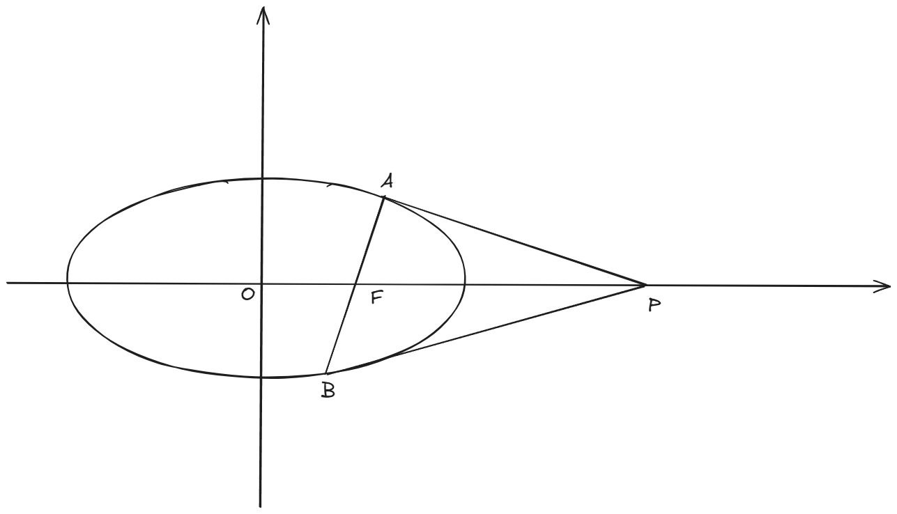

-----------------------------------------------

​	(上面的图像看起来好像PA,PB是椭圆的切线，其实不是)

​	这道题是圆锥曲线大题中最为基础的一种，曾经作为某年全国卷的考题。我就用这道题目来讲讲一般的圆锥曲线大题应该怎么去做。

​	圆锥曲线是公认的高中数学第二难（曾经是，现在数列上位了），其实，圆锥曲线的大题和导数大题有着本质区别。前者是可以通过训练来大大提高在考试中做出来的概率的，几乎能达到百分之一百。这是因为圆锥曲线的大题几乎没有创新（尤其是椭圆和双曲线的题目），题干再怎么变化，解题方法也就那寥寥几种，只要做的题够多，很多圆锥曲线题能够**一眼看穿**。导数不一样，即使你做三年导数题，也只能保证有90%的概率在高考时做出来。（如果是数列压轴，这个概率会更低）。

​	回到本题。这是一个证明题。圆曲大题如果是证明题，那么第一步就是“翻译”，也就是把我们要证明的结论给翻译成解析几何的语言。本题中我们要证明的是两个角 $\angle APF,\angle BPF$ 相等，**在解析几何中，我们一般用直线的斜率来表示角度。**所以 $\angle APF =\angle BPF$ 相当于 $k_{PA}+ k_{PB}=0$ ，那么我们要做的事情就很明确了：把直线 $PA,PB$ 的斜率表示出来，然后证明它们相等。现在 $P$ 点坐标已知，所以我们需要 $A,B$ 点的坐标，而 $A,B$ 是经过 $F$ 的直线与椭圆的两个交点，很明显我们可以设出直线 $AB$ 的方程，然后把直线方程和椭圆一联立，就得到了 $A,B$ 两点的坐标相关的韦达定理。以上就是本题的思路，应该非常清晰易懂，每一步都是有明确的逻辑来支持的。每一个圆锥曲线的大题，在下笔之前，都要设计出这样一条逻辑链，**千万不能盲目地算**（除非你只想混个过程分）。

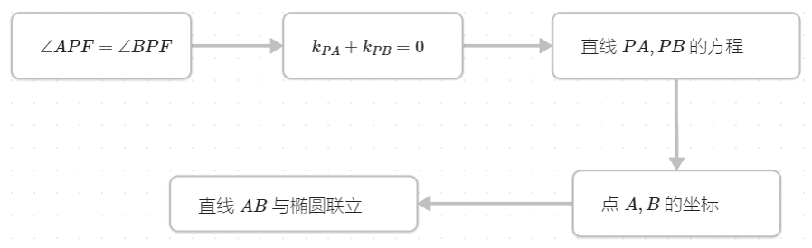

>**思考：** 之前在题3中我介绍了极点、极线的概念。本题中的点 $F$ 的极线是 $x=4$ ，而我们的点 $P$ 正是极线与 $x$ 轴的交点！实际上这就是极点、极线数不胜数的性质中的一个。前面说过圆锥曲线的绝大部分大题都是以极点、极线为背景的。
>
>另外，焦点的极线也叫做**准线**。

## 题7

已知椭圆 $\Gamma:\frac{x^2}{a^2}+\frac{y^2}{b^2}=1(a,b>0)$ ，作直线 $l$ 与椭圆 $\Gamma$ 相交，交点分别为 $A,B$ ，若坐标原点为 $O$ ，求三角形 $OAB$ 的面积 $S_{OAB}$ 的最大值。 

> 答案：$\frac{ab}{2}$

--------------------------------------------------------

​	本题也是一道经典问题，以现在的高考难度来看，放在大题第二问是不够看的，但你仍然可能在选填或者大题第一问看到本题。

​	我们先画出图像：

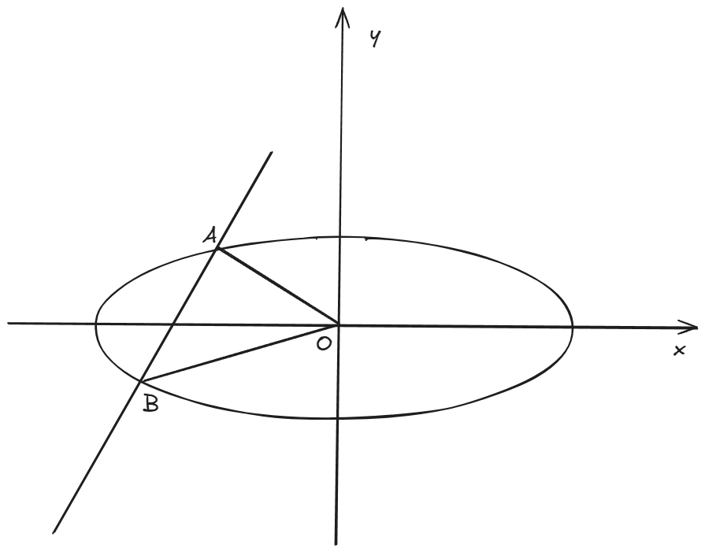

​	

​	注意本题中的椭圆实际上没有指明是长轴在 $x$ 轴上($a>b$)，但怎么画并不影响。

​	本题的逻辑链更简单了：要求 $S_{OAB}$ ，很明显我们可以把弦 $AB$ 作为底，点 $O$ 到 $AB$ 的距离作为高。所以要设出直线 $AB$ 的方程，跟椭圆联立来求弦长，再利用点到直线的距离公式求出三角形的高。这里有个坑，如果你设直线 $AB$ 的方程为 $y=kx+m$ ，那么会遗漏 $AB$ 与 $x$ 轴垂直的情况；如果你设直线 $AB$ 的方程为 $x=my+t$ ，那么会遗漏 $AB$ 与 $y$ 轴垂直的情况。所以无论怎么设，都要**分类讨论**，把和坐标轴垂直的情况单独列出来讨论，这在大题中一般占有1到2分的分值。

​	设直线 $AB$ 的方程为 $y=kx+m$ ，一通爆算之后，得到
$$
S_{OAB}=\frac{ab|m|\sqrt{a^2k^2+b^2-m^2}}{a^2k^2+b^2}
$$
​	对分子用基本不等式：
$$
\begin{align*}
S_{OAB} &\leq \frac{ab\frac{m^2+a^2k^2+b^2-m^2}{2}}{a^2k^2+b^2}\\
&=\frac{ab}{2}
\end{align*}
$$
​	当且仅当 $|m|=\sqrt{a^2k^2+b^2-m^2}$ 时取等号。

​	什么？你算出的 $S_{OAB}$ 与我的不一样？那你大概是**弦长公式**弄错了：

> 若设直线为 $y=kx+m$ ，则弦长$=\sqrt{k^2+1}|x_1-x_2|=\sqrt{(\frac{1}{k^2})^2+1}|y_1-y_2|$ 
>
> 若设直线为 $x=my+t$ ，则弦长$=\sqrt{m^2+1}|y_1-y_2|=\sqrt{(\frac{1}{m})^2+1}|x_1-x_2|$ 

## 题8

已知椭圆 $\Gamma :\frac{x^2}{4}+\frac{y^2}{3}=1$ 的左、右顶点分别为 $A$，$B$ 。设 $P$ 是椭圆 $\Gamma$ 上一点(与 $A$、$B$ 不重合)，直线 $PA$ 、$PB$ 分别与直线 $x=4$ 交于点 $M$，$N$ 。证明：点 $M$ 和 $N$ 的纵坐标之积是定值

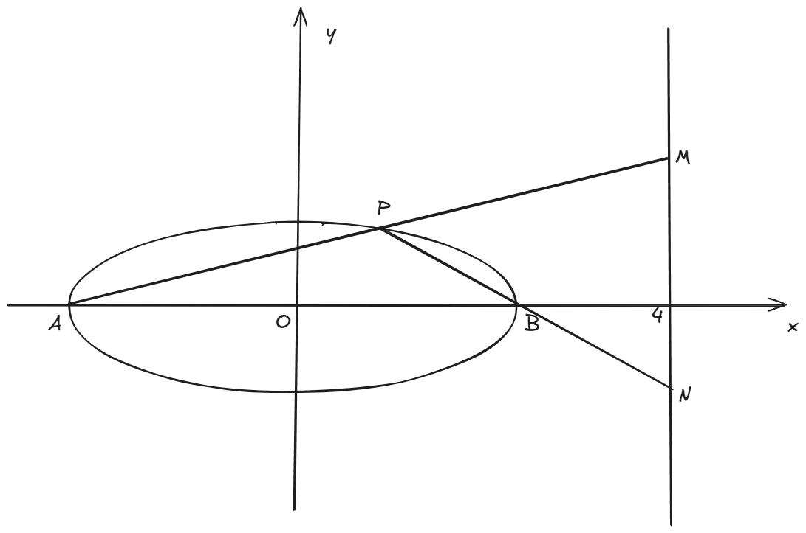

------------------------

​	**再强调一遍**：下笔之前一定要想清楚，该算些什么东西，该怎么去算。

​	本题的逻辑链如下：

​	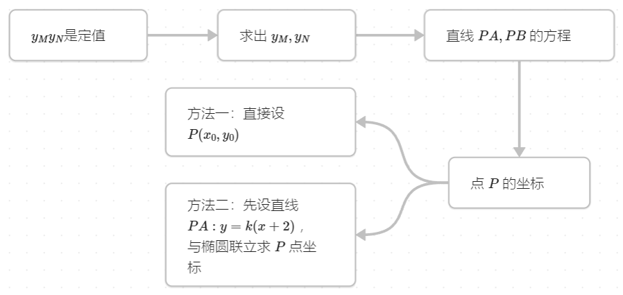

​	上面的两种方法，其实就是圆锥曲线中最基本的两种方法：**设点法**和**设线法**，或者说**点驱动**和**线驱动**。一般来说，在椭圆与双曲线的题目中，设线法用的更多；而在抛物线的题目中，设点法用的更多。但也不是绝对的，所以建议大家把上面两种方法都试一遍，好好体会它们的区别（同时训练计算能力）。

​	下面我介绍第三种方法：

​	这种方法需要用到**题2**的解析中讲到的第一个结论。观察本题的图像，我们发现 $AB$ 正是椭圆的一条直径，因此 $k_{PA}k_{PB}=e^2-1=-\frac{3}{4}$ 。所以我们可以设直线 $PA$ 的方程为 $y=k(x+2)$ ，那么直线 $PB$ 的方程就是 $y=-\frac{3}{4k}(x-2)$ 。从而求得 $M,N$ 的坐标分别为 $(4,6k),(4,-\frac{3}{2k})$ ，纵坐标之积就是定值 $-9$ 。是不是很简单？但是一定要注意一点：**二级结论在大题中不能直接使用！**所以在用二级结论之前，一定要先证明这个结论，然后作为一个引理去使用它。这个结论的证明并不难，设出点 $P$ 坐标然后直接算斜率之积就行了，留给读者作为练习。

> 思考：一般来说，使用设线法就需要与椭圆方程联立；而使用设点法需要利用“点在椭圆上”这一关系。	

## 题9

已知椭圆 $\Gamma:\frac{x^2}{4}+\frac{y^2}{3}=1$ 的右焦点为 $F$ ，过 $F$ 作直线与椭圆 $\Gamma$ 交于 $A,B$ 两点，椭圆 $\Gamma$ 在 $A,B$ 处的切线交于点 $P$ 。

(1)证明：$P$ 在直线 $x=4$ 上。

(2)证明：$PA \perp PB$ 。

(3)证明：$PF \perp AB$ 。

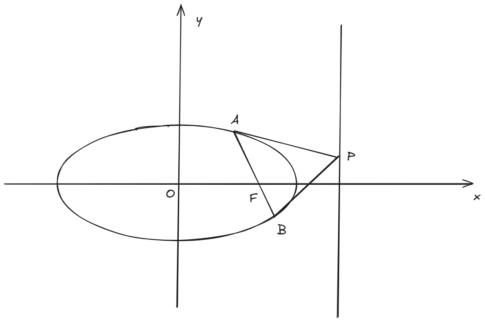

-----------------------------------------------

**解析：**

​	本题的背景就是著名的**阿基米德三角形**。这三个小问就是阿基米德三角形最主要的三个性质。

(1) 本题的逻辑链如下：

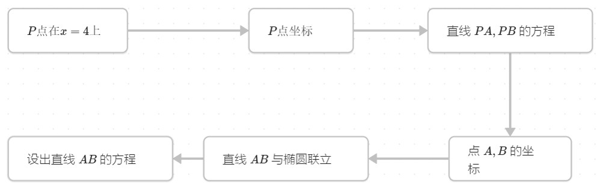

​	上面的方法，就是**设线法**。那么本题能不能用**设点法**来做呢？当然是可以的。我们既然要证明 $P$ 点的横坐标是 $4$ ，干脆直接设出 $P$ 点坐标为 $(m,n)$ , 然后去证明 $m=4$ 即可。但是，本题用设点法的话，涉及到一种所谓“同构”的思想，对于初学圆锥曲线的同学们来说，可能并不好理解。所以，这种方法我会留到之后的抛物线专题练习中再详细解释。

(2) 本题的逻辑链如下：

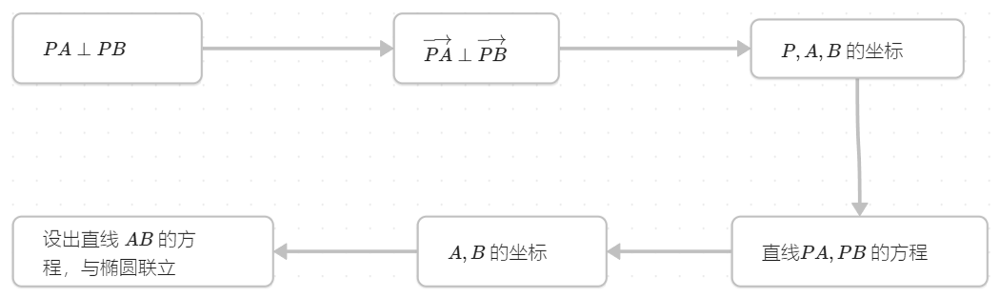

​	过程和第一问几乎是一样的，我们在第一问中已经求出了 $P,A,B$ 的坐标，所以只需要计算最后的 $\overrightarrow{PA} \perp \overrightarrow{PB}$ 即可。

(3) 思路依然和前两问一样，请自己试试画出逻辑链吧！
