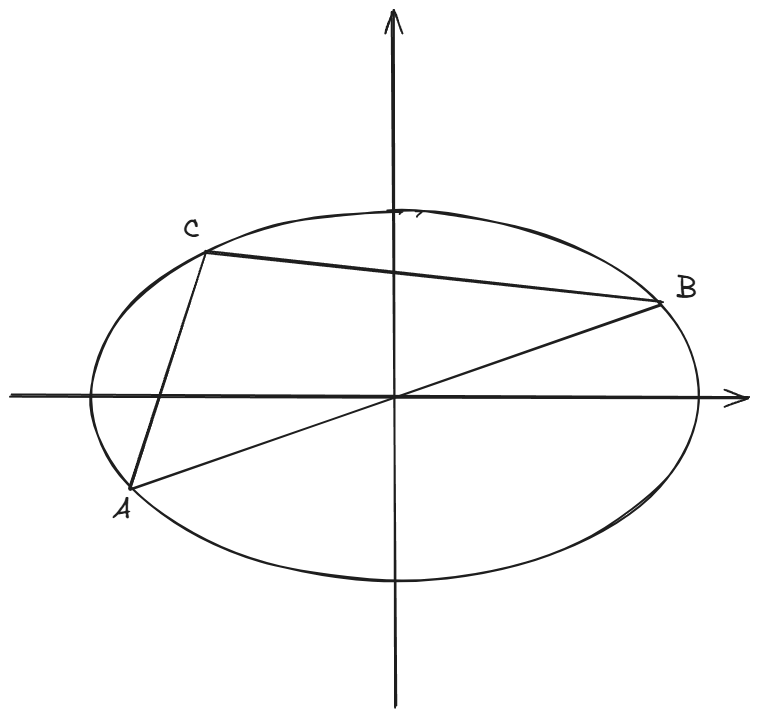

<h1>专题练习_圆锥曲线_1</h1> 

## 题1

椭圆 $\frac{x^2}{a^2}+\frac{y^2}{b^2}=1(a,b>0)$ 的一个焦点到右顶点 $(a,0)$ 的距离为 $3c$ ( $c$ 是半焦距)，则该椭圆的离心率为___

> 答案：$\frac{1}{4}$ 或 $\frac{1}{3}$ 或 $\frac{1}{2}$

--------------------------------------------------------

**解析：**

​	本题容易因为粗心而漏解。注意题干中没有指明 $a,b$ 间的大小关系，所以要分两种情况讨论。

- 当 $a>b$ 时，椭圆的两个焦点为 $(-c,0),(c,0)$ 。这两个焦点到右顶点 $(a,0)$ 的距离是不一样的，所以这里能得出两种解。
- 当 $a<b$ 时，椭圆的两个焦点为 $(0,c),(0,-c)$ 。这两个焦点到右顶点 $(a,0)$ 的距离相等，所以这里只有一种解。

## 题2

过点 $M(1,1)$ 作斜率为 $-\frac{1}{2}$ 的直线与椭圆 $C:\frac{x^2}{a^2}+\frac{y^2}{b^2}=1(a>b>0)$ 相交于 $A,B$ 两点，若 $M$ 是线段 $AB$ 的中点，则椭圆 $C$ 的离心率等于 $\underline{}\underline{}\underline{}\underline{}\underline{}\underline{}$

> 答案：$\pm \frac{1}{2}$

----------------------------------

**解析：**

​	常规方法是使用点差法。这里介绍一个**二级结论**：

> 在椭圆 $C:\frac{x^2}{a^2}+\frac{y^2}{b^2}=1$ 中，$AB$ 是一条直径（即 $AB$ 经过椭圆中心），$C$ 是椭圆上任意一点，则直线 $AC$ 的斜率 $k_1$ 和直线 $BC$ 的斜率 $k_2$ 满足关系：
> $$
> k_1k_2=e^2-1
> $$
> 其中 $e$ 是椭圆的离心率。
>
> 

​	