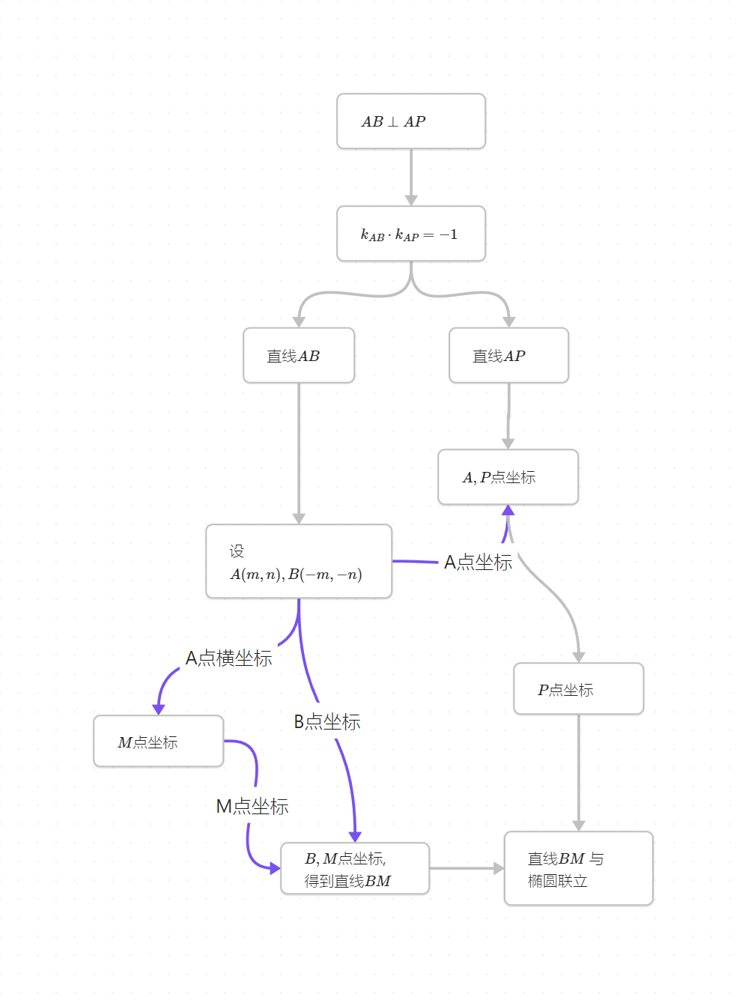

<h1>专题练习_圆锥曲线_2</h1> 

​				       2024年10月31日

## 题1

已知椭圆 $C: \frac{x^2}{2}+y^2=1$ ，过坐标原点 $O$ 的直线与椭圆交于 $A,B$ 两点（$A$ 在第一象限）。过 $A$ 作 $x$ 轴的垂线，垂足为 $M$ ，直线 $BM$ 与椭圆的另一个交点为 $P$ 。证明：$AB \perp AP$ 。

------------

​	这是十几年前江苏卷的一道题，有人认为这道题奠定了全国高考圆锥曲线题计算量大的基调。对于这道传世经典，我们用三种方法来解决。

1. 设线法

   ​	首先，设计出本题的逻辑链：

   

​	比之前稍微复杂一点，但是并不难理解。上面图中标为蓝色的地方就是**核心**，它**驱动**了整个逻辑的运转，也就是说关键步骤就是设 $AB$ 方程为 $y=kx$ ，所以前面说过设线法叫做“线驱动”。

​	一套完整、自洽的逻辑链是我们解出题目的基础，实际上这并不仅仅适用于解析几何，而适用于任何领域（也不仅仅限于数学领域）。

​	你还可以从另外的角度来理解这套逻辑。想一想，我们要画出本题的图像，顺序是怎样的？我们先画出直线 $AB$ ，再画出点 $M$ ，然后连接 $BM$ 与椭圆交于 $P$ ，最后连接 $AP$ 。整个流程的驱动力就是直线 $AB$ ，有了直线 $AB$ 才衍生出后面那么多东西。这就是为什么我们设 $AB$ 的方程，而不去设 $AP,BP$ 这些直线的方程。而且我们也**只**需要设出直线 $AB$ 的方程，因为从我们作图的流程可以看出，基本的驱动力只有直线 $AB$ ，有了它就能求出其它所有东西。

2. 设点法

​	设点法与刚才的设线法只有一点小小的区别。刚才我们说直线 $AB$ 是基本的驱动力，设出它就能求出其它所有点和直线。在设线法中，我们用直线方程 $y=kx$ 来表示直线 $AB$ ，而在设点法中，我们可以用 $A(m,n),$$B(-m.-n)$ 来表示直线 $AB$ （**无非就是强调出直线 $AB$ 是经过原点的**）。所以，设点法的逻辑链和设线法也基本一致。

​	

3. 二级结论法

   ​	观察本题的图像，其中 $AB$ 是椭圆的一条直径，而 $\angle APB$ 就是“直径所对的圆周角”，因此
   $$
   k_{PA} \cdot k_{PB} = e^2-1=-\frac{1}{2}
   $$
   ​	(如果你不知道这个结论，就去看看圆锥曲线专题练习1)

   ​	我们要证明的结论是 $AB \perp AP$ ，用斜率来表示就是
   $$
   k_{PA} \cdot k_{AB} = -1
   $$
   ​	结合上面两个式子，就有
   $$
   k_{PB} = \frac{1}{2}k_{AB}
   $$
   ​	我们要证明上面这个式子。现在设 $A(m,n),B(-m,-n),M(m,0)$ （当然你也可以用设线法来表示），那么 $k_{AB}=\frac{n}{m}$ ，而 $k_{PB} = k_{MB} = \frac{n}{2m}$ ，所以确实有 $k_{PB} = \frac{1}{2}k_{AB}$ 。结束。

   ​	这种方法几乎没有计算量（前提是你能想到），如果你试过设点法和设线法，它们的计算量还是有点强度的。

​	

​	这道题目由于太过于经典，以至于被2019年全国二卷改编过后拿来作为压轴题。如下：

> 已知点 $A(-2,0),B(2,0)$ ，动点 $M(x,y)$ 满足直线 $AM$ 与 $BM$ 的斜率之积为 $-\frac{1}{2}$ ，记 $M$ 的轨迹为曲线 $C$ 。
>
> (1) 求 $C$ 的方程，并说明 $C$ 是什么曲线。
>
> (2) 过坐标原点的直线交 $C$ 于 $P,Q$ 两点，点 $P$ 在第一象限，$PE \perp x$轴，垂足为 $E$ ，连结 $QE$ 并延长交 $C$ 与点 $G$ 。
>
> (i) 证明:$\triangle PQG$ 是直角三角形。
>
> (ii) 求 $\triangle PQG$ 面积的最大值。

​	其中(2)(i)就是原题，而(2)(ii)在原题的基础上作了一个简单的推广。

## 题2

已知椭圆 $\frac{x^2}{3}+\frac{y^2}{2}=1$，$A_1,A_2$ 分别为椭圆的左右顶点，已知直线 $l$ 过定点 $M(\frac{1}{2},0)$ 交椭圆于 $C,D$ 两点。求证：$A_1C$ 与 $A_2D$ 两直线的交点在一条定直线上。

  

-------------------------------------

**解析：**

​	在**圆锥曲线专题练习1**中，我介绍过所谓**极点、极线**的概念。当时，我只是粗略地介绍：

- 当极点位于圆锥曲线内时，极线位于圆锥曲线外。
- 当极点位于圆锥曲线外时，极线位于圆锥曲线内

​	上面的叙述，并没有指明极点、极线确切的位置关系，尽管大家已经知道可以根据极点坐标 $(x_0,y_0)$ 求出对应的极线方程: $\frac{x_0x}{a^2}+\frac{y_0y}{b^2}=1$ ，但是我们如何在几何上确定极点和极线？于是，补充相关知识如下：

> 当极点 $P$ 位于圆锥曲线（不妨考虑椭圆）内部时， $P$ 的极线按如下方式确定：
>
> 
>
> 如上图，$P$ 是椭圆内一点（作为极点），过 $P$ **任意**作两条直线 $AB,CD$ ，设直线 $AD, BC$ 交于 $M$ ，直线 $AC, BD$ 交于 $N$ ，则直线 $MN$ 就是 $P$ 的极线。
>
> 上面的过程是可逆的，也就是说，不仅 $M$ 位于 $P$ 的极线上，其实 $P$ 也位于 $M$ 的极线上（不过在上面没有画出来）！同理，$P$ 也位于 $N$ 的极线上。所以这就指明了，如果极点位于圆锥曲线外，那么它的极线应该如何确定，过程如下：
>
> 
>
> 如上图，$M$ 是圆锥曲线外一点（作为极点），过 $M$ 作两条直线与椭圆交于 $4$ 点，然后连接这 $4$ 点的对角线，得到交点 $P$ ，然后用同样的方法得到另一个交点 $Q$ ，那么由于 $P$ 和 $Q$ 都在 $M$ 的极线上（这是因为 $M$ 在 $P$ 和 $Q$ 的极线上，这种关系是相互的），而两点确定一条直线，所以直线 $PQ$ 就是 $M$ 的极线。

​	现在，回过头看本题的图像。**仔细看！**，如果 $M$ 作为极点，那么 $P$ 是不是正位于 $M$ 的极线上？（当然， $M$ 也位于 $P$ 的极线上，前面说过这种关系是相互的）尽管这里我们没有确定出位于极线上的另一点 $N$，但是对本题而言，我们知道 $P$ 位于 $M$ 的极线上就足够了。因为本题正是要证明 $P$ 位于一条定直线上，**所以这条定直线就是 $M$ 的极线！**也就是 $x = 6$ 。 

​	别高兴太早，现在我们面临一个新的问题：**极点、极线不能在大题中书写**。如果你在考试的时候这样做，会被扣分（基本上只有答案分）。既然如此，我们还有学习极点、极线的必要吗？当然有，因为它能帮助我们快速地得到大题的正确答案，这是非常有帮助的。例如：

- 如果这题计算量大，而你算到天荒地老发现结果错了，一瞬间天都塌了。并且你没有时间、或者不想从头再来，那么这个时候你可以尝试**蒙混过关**。比如你用极点、极线事先确定出了正确答案是 $a$ ,而你计算一个非常复杂的表达式时发现结果是 $b$ ，但你非常狡猾地在答题卡上写道： **表达式**$=a$ 。阅卷老师不会去看你的计算过程，他只关心你的结果，以及你的大体流程。 不排除有失手的情况，所以不要依赖这种方法。

​	我在高中时研究过很多圆曲的题目，根据我的经验，对于绝大部分题目而言，事先通过某些手段（不仅仅是极点极线）得出正确答案，对于解答本题是非常非常有帮助的。我觉得做每个题目时都应该花几分钟时间去尝试这一点。当然，这里面有很多技巧，不仅仅只有极点极线。我会在以后的题目解析中给出。

​	现在回到本题，我们通过强大的极点极线得出了正确答案后，接下来就要用正常的高中数学方法来书写过程了。

​	显然，本题最核心、最重要的直线是 $l$ ，也就是直线 $CD$ 。于是我们设 $l:x=my+\frac{1}{2}$ ，点 $C,D$ 的坐标分别为 $(x_1,y_1),(x_2,y_2)$ 。联立：（有一点需要注意，直线 $l$ 的方程当然也可以设为 $y=k(x-\frac{1}{2})$ ，但是，反设 $x=my+\frac{1}{2}$ 更好，这是因为我们就不需要去特别讨论直线垂直于 $x$ 轴的情况了，因为方程 $x=my+\frac{1}{2}$ 包含直线垂直 $x$ 轴的情况，它只是不能表达垂直于 $y$ 轴的情况，而本题中的 $l$ 不可能垂直 $y$ 轴。
$$
\left\{
\begin{align*}
x=my+\frac{1}{2}\\
2x^2+3y^2=6
\end{align*}
\right.
$$
​	得到（尽管考试的时候不建议，但平时练习时可以试试心算这个联立方程）
$$
\begin{equation*}
(2m^2+3)y^2+2my-\frac{11}{2}=0
\end{equation*}
$$
​	根据韦达定理，我们有（这一步有2分，考试必拿）
$$
\left \{
\begin{align*}
y_1+y_2=-\frac{2m}{2m^2+3}\\
y_1y_2=-\frac{11}{2(2m^2+3)}
\end{align*}
\right.
$$
​	直线 $A_1C$ 的方程为：$y = \frac{y_1}{x_1+\sqrt{3}}(x+\sqrt{3})$ 

​	直线 $A_2D$ 的方程为：$y=\frac{y_2}{x_2-\sqrt{3}}(x-\sqrt{3})$

​	联立它们，得到 $P$ 点横坐标为（我们只需要横坐标，因为是要证明 $x_P = 6$,这里就体现出我们事先得到正确答案的优势了，如果你不知道它位于的定直线是垂直 $x$ 轴的，那么你还要考虑 $y_P$)。

​	下面的计算过程，可以试试不使用草稿纸完成:
$$
\begin{align*}
x_P &= \sqrt{3}\cdot\frac{\frac{y_2}{x_2-\sqrt{3}}+\frac{y_1}{x_1+\sqrt{3}}}{\frac{y_2}{x_2-\sqrt{3}}-\frac{y_1}{x_1+\sqrt{3}}}\\
&= \sqrt{3}\cdot\frac{y_2(x_1+\sqrt{3})+y_1(x_2-\sqrt{3})}{y_2(x_1+\sqrt{3})-y_1(x_2-\sqrt{3})}
\end{align*}
$$
​	到这一步怎么往下做呢？我们之前的韦达定理得到的是关于 $y_1,y_2$ 的式子，所以我们应该把 $x_1,x_2$ 转换成 $y_1,y_2$ 。因为我们有 $x_1=my_1+\frac{1}{2},x_2=my_2+\frac{1}{2}$ ，代入上式得到：
$$
\begin{align*}
x_P &= \sqrt{3}\cdot\frac{y_2(my_1+\frac{1}{2}+\sqrt{3})+y_1(my_2+\frac{1}{2}-\sqrt{3})}{y_2(my_1+\frac{1}{2}+\sqrt{3})-y_1(my_2+\frac{1}{2}-\sqrt{3})}\\
&=\sqrt{3}\cdot \frac{2my_1y_2+(\frac{1}{2}-\sqrt{3})y_1+(\frac{1}{2}+\sqrt{3})y_2}{(\sqrt{3}-\frac{1}{2})y_1+(\frac{1}{2}+\sqrt{3})y_2}\\
\end{align*}
$$
​	到这一步，又怎么往下做？这个式子里面有 $y_1y_2$ ，这是可以使用韦达定理来替换的。然而我们不能使用 $y_1+y_2$ 来替换其他项，因为不管是分子还是分母， $y_1$ 和 $y_2$ 的系数都不相等！

​	这里就涉及到圆锥曲线为数不多的**技巧**之一了：非对称韦达定理。

​	就像上面那个式子一样，$y_1$ 和 $y_2$ 的系数不相等，是不对称的，我们不能用 $y_1+y_2$ 来替换。像这样的情况，我们只需要把 $y_1y_2$ 表示成 $y_1+y_2$ 即可，看下面的操作：

​	我们已经知道 $y_1+y_2=-\frac{2m}{2m^2+3},y_1y_2=-\frac{11}{2(2m^2+3)}$ ，可以得到 $y_1y_2 = \frac{11}{4m}(y_1+y_2)$ ，我们把这个式子代入上面的  $x_P$ 中，就有：
$$
\begin{align*}
x_P &= \sqrt{3}\cdot\frac{\frac{11}{2}(y_1+y_2)+(\frac{1}{2}-\sqrt{3})y_1+(\frac{1}{2}+\sqrt{3})y_2}{(\sqrt{3}-\frac{1}{2})y_1+(\frac{1}{2}+\sqrt{3})y_2}\\
&=\sqrt{3}\cdot\frac{(6-\sqrt{3})y_1+(6+\sqrt{3})y_2}{(\sqrt{3}-\frac{1}{2})y_1+(\frac{1}{2}+\sqrt{3})y_2}\\
&=6
\end{align*}
$$
​	上面最后一步的 $=6$ 是如何得出的？并不是我在‘蒙混过关’，而是因为：
$$
\frac{6-\sqrt{3}}{\sqrt{3}-\frac{1}{2}} = \frac{6+\sqrt{3}}{\frac{1}{2}+\sqrt{3}}=2\sqrt{3}\\
\frac{(6-\sqrt{3})y_1+(6+\sqrt{3})y_2}{(\sqrt{3}-\frac{1}{2})y_1+(\frac{1}{2}+\sqrt{3})y_2}=2\sqrt{3}\cdot\frac{(\sqrt{3}-\frac{1}{2})y_1+(\frac{1}{2}+\sqrt{3})y_2}{(\sqrt{3}-\frac{1}{2})y_1+(\frac{1}{2}+\sqrt{3})y_2}=2\sqrt{3}
$$
 	这就是非对称韦达定理，一个特别的技巧。
