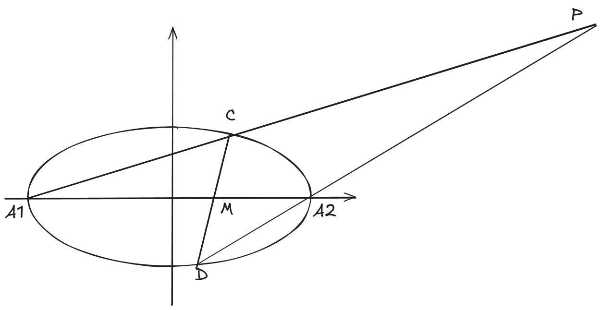
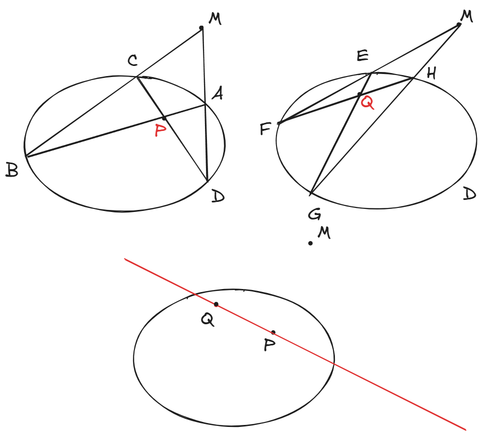
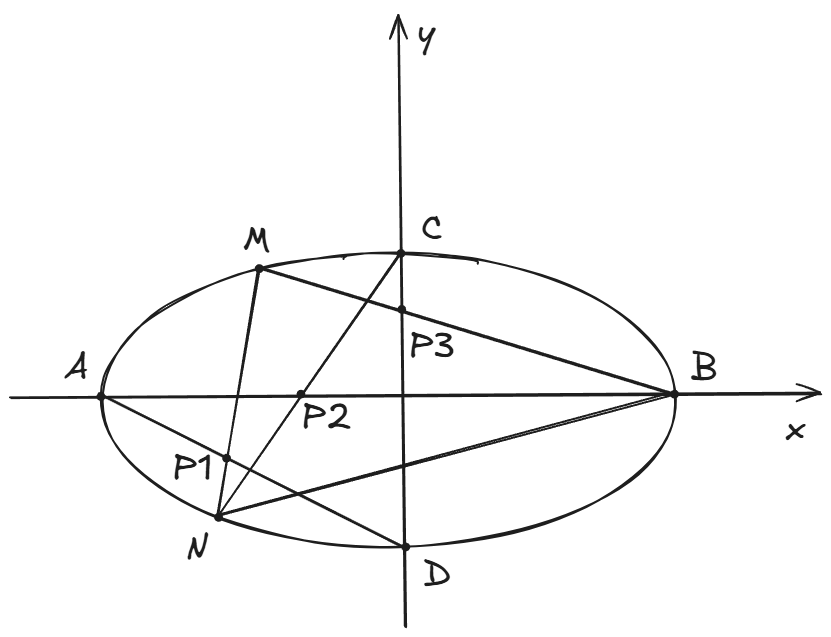

<h1>专题练习_圆锥曲线_2</h1> 

​				      							     2024年10月31日

> ​													**前言**
>
> ​	虽然说是专题练习，但写完后回头一看，发现研究的味道太重了一些。
>
> ​	我高中时看过一本书，叫做《圆锥曲线的秘密》。书写的很好，但是当时看的时候就觉得作者没有把它当作一本面向高中生、面向应试的习题集来写，而是作为一本圆锥曲线的百科全书，里面充满了各种定理、性质的研究。我觉得很奇怪，因为“秘密”系列的其他几本书我都看过，例如《导数的秘密》，《数列的秘密》，《向量与立体几何的秘密》，这些书虽然难度高、深度大，但是还是以面向考试为主，讲解各种技巧。为什么唯独《圆锥曲线的秘密》写得如此与众不同、超凡脱俗，我大概是理解了。圆锥曲线的性质如此丰富、如此奇妙，就像一个取之不尽、用之不竭的宝库，吸引人不断地从中挖掘瑰奇。所以，希望大家不要以应试的功利心态看待圆锥曲线，不要被那些枯燥繁杂的计算消磨耐心，要去欣赏它的几何之美。	

## 题1

已知椭圆 $C: \frac{x^2}{2}+y^2=1$ ，过坐标原点 $O$ 的直线与椭圆交于 $A,B$ 两点（$A$ 在第一象限）。过 $A$ 作 $x$ 轴的垂线，垂足为 $M$ ，直线 $BM$ 与椭圆的另一个交点为 $P$ 。证明：$AB \perp AP$ 。

------------

​	这是十几年前江苏卷的一道题，有人认为这道题奠定了全国高考圆锥曲线题计算量大的基调。对于这道传世经典，我们用三种方法来解决。

1. 设线法

   ​	首先，设计出本题的逻辑链：

   

​	比之前稍微复杂一点，但是并不难理解。上面图中标为蓝色的地方就是**核心**，它**驱动**了整个逻辑的运转，也就是说关键步骤就是设 $AB$ 方程为 $y=kx$ ，所以前面说过设线法叫做“线驱动”。

​	一套完整、自洽的逻辑链是我们解出题目的基础，实际上这并不仅仅适用于解析几何，而适用于任何领域（也不仅仅限于数学领域）。

​	你还可以从另外的角度来理解这套逻辑。想一想，我们要画出本题的图像，顺序是怎样的？我们先画出直线 $AB$ ，再画出点 $M$ ，然后连接 $BM$ 与椭圆交于 $P$ ，最后连接 $AP$ 。整个流程的驱动力就是直线 $AB$ ，有了直线 $AB$ 才衍生出后面那么多东西。这就是为什么我们设 $AB$ 的方程，而不去设 $AP,BP$ 这些直线的方程。而且我们也**只**需要设出直线 $AB$ 的方程，因为从我们作图的流程可以看出，基本的驱动力只有直线 $AB$ ，有了它就能求出其它所有东西。

2. 设点法

​	设点法与刚才的设线法只有一点小小的区别。刚才我们说直线 $AB$ 是基本的驱动力，设出它就能求出其它所有点和直线。在设线法中，我们用直线方程 $y=kx$ 来表示直线 $AB$ ，而在设点法中，我们可以用 $A(m,n),$$B(-m.-n)$ 来表示直线 $AB$ （**无非就是强调出直线 $AB$ 是经过原点的**）。所以，设点法的逻辑链和设线法也基本一致。

​	

3. 二级结论法

   ​	观察本题的图像，其中 $AB$ 是椭圆的一条直径，而 $\angle APB$ 就是“直径所对的圆周角”，因此
   $$
   k_{PA} \cdot k_{PB} = e^2-1=-\frac{1}{2}
   $$
   ​	(如果你不知道这个结论，就去看看圆锥曲线专题练习1)

   ​	我们要证明的结论是 $AB \perp AP$ ，用斜率来表示就是
   $$
   k_{PA} \cdot k_{AB} = -1
   $$
   ​	结合上面两个式子，就有
   $$
   k_{PB} = \frac{1}{2}k_{AB}
   $$
   ​	我们要证明上面这个式子。现在设 $A(m,n),B(-m,-n),M(m,0)$ （当然你也可以用设线法来表示），那么 $k_{AB}=\frac{n}{m}$ ，而 $k_{PB} = k_{MB} = \frac{n}{2m}$ ，所以确实有 $k_{PB} = \frac{1}{2}k_{AB}$ 。结束。

   ​	这种方法几乎没有计算量（前提是你能想到），如果你试过设点法和设线法，它们的计算量还是有点强度的。

​	

​	这道题目由于太过于经典，以至于被2019年全国二卷改编过后拿来作为压轴题。如下：

> 已知点 $A(-2,0),B(2,0)$ ，动点 $M(x,y)$ 满足直线 $AM$ 与 $BM$ 的斜率之积为 $-\frac{1}{2}$ ，记 $M$ 的轨迹为曲线 $C$ 。
>
> (1) 求 $C$ 的方程，并说明 $C$ 是什么曲线。
>
> (2) 过坐标原点的直线交 $C$ 于 $P,Q$ 两点，点 $P$ 在第一象限，$PE \perp x$轴，垂足为 $E$ ，连结 $QE$ 并延长交 $C$ 与点 $G$ 。
>
> (i) 证明:$\triangle PQG$ 是直角三角形。
>
> (ii) 求 $\triangle PQG$ 面积的最大值。

​	其中(2)(i)就是原题，而(2)(ii)在原题的基础上作了一个简单的推广。

## 题2

已知椭圆 $\frac{x^2}{3}+\frac{y^2}{2}=1$，$A_1,A_2$ 分别为椭圆的左右顶点，已知直线 $l$ 过定点 $M(\frac{1}{2},0)$ 交椭圆于 $C,D$ 两点。求证：$A_1C$ 与 $A_2D$ 两直线的交点在一条定直线上。

  

-------------------------------------

**解析：**

​	在**圆锥曲线专题练习1**中，我介绍过所谓**极点、极线**的概念。当时，我只是粗略地介绍：

- 当极点位于圆锥曲线内时，极线位于圆锥曲线外。
- 当极点位于圆锥曲线外时，极线位于圆锥曲线内

​	上面的叙述，并没有指明极点、极线确切的位置关系，尽管大家已经知道可以根据极点坐标 $(x_0,y_0)$ 求出对应的极线方程: $\frac{x_0x}{a^2}+\frac{y_0y}{b^2}=1$ ，但是我们如何在几何上确定极点和极线？于是，补充相关知识如下：

> 当极点 $P$ 位于圆锥曲线（不妨考虑椭圆）内部时， $P$ 的极线按如下方式确定：
>
> 
>
> 如上图，$P$ 是椭圆内一点（作为极点），过 $P$ **任意**作两条直线 $AB,CD$ ，设直线 $AD, BC$ 交于 $M$ ，直线 $AC, BD$ 交于 $N$ ，则直线 $MN$ 就是 $P$ 的极线。
>
> 上面的过程是可逆的，也就是说，不仅 $M$ 位于 $P$ 的极线上，其实 $P$ 也位于 $M$ 的极线上（不过在上面没有画出来）！同理，$P$ 也位于 $N$ 的极线上。所以这就指明了，如果极点位于圆锥曲线外，那么它的极线应该如何确定，过程如下：
>
> 
>
> 如上图，$M$ 是圆锥曲线外一点（作为极点），过 $M$ 作两条直线与椭圆交于 $4$ 点，然后连接这 $4$ 点的对角线，得到交点 $P$ ，然后用同样的方法得到另一个交点 $Q$ ，那么由于 $P$ 和 $Q$ 都在 $M$ 的极线上（这是因为 $M$ 在 $P$ 和 $Q$ 的极线上，这种关系是相互的），而两点确定一条直线，所以直线 $PQ$ 就是 $M$ 的极线。

​	现在，回过头看本题的图像。**仔细看！**，如果 $M$ 作为极点，那么 $P$ 是不是正位于 $M$ 的极线上？（当然， $M$ 也位于 $P$ 的极线上，前面说过这种关系是相互的）尽管这里我们没有确定出位于极线上的另一点 $N$，但是对本题而言，我们知道 $P$ 位于 $M$ 的极线上就足够了。因为本题正是要证明 $P$ 位于一条定直线上，**所以这条定直线就是 $M$ 的极线！**也就是 $x = 6$ 。 

​	别高兴太早，现在我们面临一个新的问题：**极点、极线不能在大题中书写**。如果你在考试的时候这样做，会被扣分（基本上只有答案分）。既然如此，我们还有学习极点、极线的必要吗？当然有，因为它能帮助我们快速地得到大题的正确答案，这是非常有帮助的。例如：

- 如果这题计算量大，而你算到天荒地老发现结果错了，一瞬间天都塌了。并且你没有时间、或者不想从头再来，那么这个时候你可以尝试**蒙混过关**。比如你用极点、极线事先确定出了正确答案是 $a$ ,而你计算一个非常复杂的表达式时发现结果是 $b$ ，但你非常狡猾地在答题卡上写道： **表达式**$=a$ 。阅卷老师不会去看你的计算过程，他只关心你的结果，以及你的大体流程。 不排除有失手的情况，所以不要依赖这种方法。

​	我在高中时研究过很多圆曲的题目，根据我的经验，对于绝大部分题目而言，事先通过某些手段（不仅仅是极点极线）得出正确答案，对于解答本题是非常非常有帮助的。我觉得做每个题目时都应该花几分钟时间去尝试这一点。当然，这里面有很多技巧，不仅仅只有极点极线。我会在以后的题目解析中给出。

​	现在回到本题，我们通过强大的极点极线得出了正确答案后，接下来就要用正常的高中数学方法来书写过程了。

​	显然，本题最核心、最重要的直线是 $l$ ，也就是直线 $CD$ 。于是我们设 $l:x=my+\frac{1}{2}$ ，点 $C,D$ 的坐标分别为 $(x_1,y_1),(x_2,y_2)$ 。联立：（有一点需要注意，直线 $l$ 的方程当然也可以设为 $y=k(x-\frac{1}{2})$ ，但是，反设 $x=my+\frac{1}{2}$ 更好，这是因为我们就不需要去特别讨论直线垂直于 $x$ 轴的情况了，因为方程 $x=my+\frac{1}{2}$ 包含直线垂直 $x$ 轴的情况，它只是不能表达垂直于 $y$ 轴的情况，而本题中的 $l$ 不可能垂直 $y$ 轴。
$$
\left\{
\begin{align*}
x=my+\frac{1}{2}\\
2x^2+3y^2=6
\end{align*}
\right.
$$
​	得到（尽管考试的时候不建议，但平时练习时可以试试心算这个联立方程）
$$
\begin{equation*}
(2m^2+3)y^2+2my-\frac{11}{2}=0
\end{equation*}
$$
​	根据韦达定理，我们有（这一步有2分，考试必拿）
$$
\left \{
\begin{align*}
y_1+y_2=-\frac{2m}{2m^2+3}\\
y_1y_2=-\frac{11}{2(2m^2+3)}
\end{align*}
\right.
$$
​	直线 $A_1C$ 的方程为：$y = \frac{y_1}{x_1+\sqrt{3}}(x+\sqrt{3})$ 

​	直线 $A_2D$ 的方程为：$y=\frac{y_2}{x_2-\sqrt{3}}(x-\sqrt{3})$

​	联立它们，得到 $P$ 点横坐标为（我们只需要横坐标，因为是要证明 $x_P = 6$,这里就体现出我们事先得到正确答案的优势了，如果你不知道它位于的定直线是垂直 $x$ 轴的，那么你还要考虑 $y_P$)。

​	下面的计算过程，可以试试不使用草稿纸完成:
$$
\begin{align*}
x_P &= \sqrt{3}\cdot\frac{\frac{y_2}{x_2-\sqrt{3}}+\frac{y_1}{x_1+\sqrt{3}}}{\frac{y_2}{x_2-\sqrt{3}}-\frac{y_1}{x_1+\sqrt{3}}}\\
&= \sqrt{3}\cdot\frac{y_2(x_1+\sqrt{3})+y_1(x_2-\sqrt{3})}{y_2(x_1+\sqrt{3})-y_1(x_2-\sqrt{3})}
\end{align*}
$$
​	到这一步怎么往下做呢？我们之前的韦达定理得到的是关于 $y_1,y_2$ 的式子，所以我们应该把 $x_1,x_2$ 转换成 $y_1,y_2$ 。因为我们有 $x_1=my_1+\frac{1}{2},x_2=my_2+\frac{1}{2}$ ，代入上式得到：
$$
\begin{align*}
x_P &= \sqrt{3}\cdot\frac{y_2(my_1+\frac{1}{2}+\sqrt{3})+y_1(my_2+\frac{1}{2}-\sqrt{3})}{y_2(my_1+\frac{1}{2}+\sqrt{3})-y_1(my_2+\frac{1}{2}-\sqrt{3})}\\
&=\sqrt{3}\cdot \frac{2my_1y_2+(\frac{1}{2}-\sqrt{3})y_1+(\frac{1}{2}+\sqrt{3})y_2}{(\sqrt{3}-\frac{1}{2})y_1+(\frac{1}{2}+\sqrt{3})y_2}\\
\end{align*}
$$
​	到这一步，又怎么往下做？这个式子里面有 $y_1y_2$ ，这是可以使用韦达定理来替换的。然而我们不能使用 $y_1+y_2$ 来替换其他项，因为不管是分子还是分母， $y_1$ 和 $y_2$ 的系数都不相等！

​	这里就涉及到圆锥曲线为数不多的**技巧**之一了：非对称韦达定理。

​	就像上面那个式子一样，$y_1$ 和 $y_2$ 的系数不相等，是不对称的，我们不能用 $y_1+y_2$ 来替换。像这样的情况，我们只需要把 $y_1y_2$ 表示成 $y_1+y_2$ 即可，看下面的操作：

​	我们已经知道 $y_1+y_2=-\frac{2m}{2m^2+3},y_1y_2=-\frac{11}{2(2m^2+3)}$ ，可以得到 $y_1y_2 = \frac{11}{4m}(y_1+y_2)$ ，我们把这个式子代入上面的  $x_P$ 中，就有：
$$
\begin{align*}
x_P &= \sqrt{3}\cdot\frac{\frac{11}{2}(y_1+y_2)+(\frac{1}{2}-\sqrt{3})y_1+(\frac{1}{2}+\sqrt{3})y_2}{(\sqrt{3}-\frac{1}{2})y_1+(\frac{1}{2}+\sqrt{3})y_2}\\
&=\sqrt{3}\cdot\frac{(6-\sqrt{3})y_1+(6+\sqrt{3})y_2}{(\sqrt{3}-\frac{1}{2})y_1+(\frac{1}{2}+\sqrt{3})y_2}\\
&=6
\end{align*}
$$
​	上面最后一步的 $=6$ 是如何得出的？并不是我在‘蒙混过关’，而是因为：
$$
\frac{6-\sqrt{3}}{\sqrt{3}-\frac{1}{2}} = \frac{6+\sqrt{3}}{\frac{1}{2}+\sqrt{3}}=2\sqrt{3}\\
\frac{(6-\sqrt{3})y_1+(6+\sqrt{3})y_2}{(\sqrt{3}-\frac{1}{2})y_1+(\frac{1}{2}+\sqrt{3})y_2}=2\sqrt{3}\cdot\frac{(\sqrt{3}-\frac{1}{2})y_1+(\frac{1}{2}+\sqrt{3})y_2}{(\sqrt{3}-\frac{1}{2})y_1+(\frac{1}{2}+\sqrt{3})y_2}=2\sqrt{3}
$$
​	这就是非对称韦达定理，一个特别的技巧。

## 题3

已知椭圆 $\frac{x^2}{4}+\frac{y^2}{3}=1$ 的左、右顶点分别为 $A,B$ ，上、下顶点分别为 $C,D$ 。$M(-1,\frac{3}{2})$ 是椭圆上一点， $N$ 是椭圆上位于 $x$ 轴下方的任意一点。 设直线 $AD,MN$ 交于 $P_1$ ，直线 $AB,CN$ 交于 $P_2$ ，直线 $BM,CD$ 交于 $P_3$ ，证明：$P_1,P_2,P_3$ 三点共线。

---------------------------------------------------------------------

**解析：**

​	这道题目看上去有点吓人，点和线很多。其实和一般的题目相比，只是计算量稍微大了一点而已。

​	本题的背景，是著名的**帕斯卡定理**。

> *圆锥曲线(包括直线和圆)的内接六边形，其三组对边的三个交点共线。*

​	看上面的椭圆，刚好有六个点 $A,M,C,B,D,N$ ，可以构成椭圆的一个内接六边形。而 $P_1,P_2,P_3$ 正是这个六边形的三组对边的三个交点，根据帕斯卡定理，它们三点共线。

​	好了，介绍完本题的背景，下面我们来循规蹈矩地证明：

*proof:*

​	显然 $A(-2,0),B(2,0),C(0,\sqrt{3}),D(0,-\sqrt{3})$ 。另外还已知 $M(-1,\frac{3}{2})$ 。

​	本题的点、线关系貌似很复杂，其实很简单，因为唯一在“动”的元素，只有 $N$ 点，其它五个点的坐标都是已知的，所以，我们只需要设出 $N$ 点坐标为 $(m,n)$,其中 $n < 0$ 。

​	下面来求三个交点 $P_1,P_2,P_3$ 。

​	直线 $AD:y=\frac{\sqrt{3}}{2}x+\sqrt{3}$ 

​	直线 $MN:y=\frac{2n-3}{2m+2}(x+1)+\frac{3}{2}$ 。这里有个细节，直线 $MN$ 是可以垂直 $x$ 轴的，这个情况我们需要单独讨论。留到最后再写。（有一种避免分类讨论的方法，就是把 $MN$ 的方程写成 $x=my+t$  的形式，因为它能表达直线垂直 $x$ 轴的情况）。

​	现在联立上面两条直线，就可以求出 $P_1$ 的坐标：
$$
\left\{
\begin{align*}
x_{P_1}&=\frac{\frac{2n-3}{2m+2}+\frac{3}{2}-\sqrt{3}}{\frac{\sqrt{3}}{2}-\frac{2n-3}{2m+2}}\\
y_{P_1}&=\frac{\sqrt{3}}{2}\cdot\frac{\frac{2n-3}{2m+2}+\frac{3}{2}-\sqrt{3}}{\frac{\sqrt{3}}{2}-\frac{2n-3}{2m+2}}+\sqrt{3}
\end{align*}
\right.
$$
​	上面的坐标还没有化简。这两个式子长得非常非常丑陋，即使化简了也好看不到哪里去。我们先把剩下两个点算出来。

​	直线 $CN:y=\frac{n-\sqrt{3}}{m}x+\sqrt{3}$ 。这里也有个细节，$CN$ 也是可以垂直于 $x$ 轴的，但是这个时候 $P_1,P_2,P_3$ 显然都在 $y$ 轴上，所以三点共线成立。

​	直线 $AB$ 就是 $x$ 轴，所以 $P_2$ 就是 $CN$ 和 $x$ 轴的交点。
$$
\left\{
\begin{align*}
x_{P_2}&=\frac{\sqrt{3}m}{\sqrt{3}-n}\\
y_{P_2}&=0
\end{align*}
\right.
$$

​	直线 $BM:y=\frac{n}{m-1}(x-2)$ 

​	直线 $CD$ 就是 $y$ 轴，所以 $P_3$ 就是 $BM$ 和 $y$ 轴的交点。
$$
\left\{
\begin{align*}
x_{P_3}&=0\\
y_{P_3}&=\frac{2n}{1-m}
\end{align*}
\right.
$$
​	至此，$P_1,P_2,P_3$ 三点的坐标都已求出。下面要证明它们三点共线，也就是证明 $P_1P_2$ 的斜率等于 $P_2P_3$ 的斜率（或者 $P_1P_2$ 的斜率等于 $P_1P_3$ 的斜率之类的，只不过 $P_2P_3$ 的斜率明显最好算）。

​	$P_1P_2$ 的斜率为：
$$
\begin{align*}
k_{P_1P_2} &= \frac{y_{P2}-y_{P1}}{x_{P2}-x_{P1}}\\
&=\frac{\frac{\sqrt{3}}{2}\cdot\frac{\frac{2n-3}{2m+2}+\frac{3}{2}-\sqrt{3}}{\frac{\sqrt{3}}{2}-\frac{2n-3}{2m+2}}+\sqrt{3}}{\frac{\frac{2n-3}{2m+2}+\frac{3}{2}-\sqrt{3}}{\frac{\sqrt{3}}{2}-\frac{2n-3}{2m+2}}-\frac{\sqrt{3}m}{\sqrt{3}-n}}\\
&=
\end{align*}
$$

​	看到上面这一坨，你肯定没有任何化简它的兴趣。我们不妨先算出比较简单的 $P_2P_3$ 的斜率，因为我们知道这两个斜率肯定相等（除非题目让你证明的结论本身是错的，或者你算错了——-这个时候我们可以尝试”蒙混过关“。看下面的操作：	

​	$P_2P_3$ 的斜率为：
$$
\begin{align*}
k_{P_2P_3} &= \frac{y_{P_3}-y_{P_2}}{x_{P_3}-x_{P_2}}\\
&=\frac{\frac{2n}{1-m}}{\frac{\sqrt{3}m}{n-\sqrt{3}}}\\
&=\frac{2n(n-\sqrt{3})}{\sqrt{3}m(1-m)}
\end{align*}
$$

​	好了，我们知道上面两个斜率肯定相等（如果没算错的话）。假如考试的时候你没有时间、或者不想算第一个斜率，那么直接在答题卡上面写：
$$
\begin{align*}
k_{P_1P_2} &= \frac{y_{P2}-y_{P1}}{x_{P2}-x_{P1}}\\
&=\frac{\frac{\sqrt{3}}{2}\cdot\frac{\frac{2n-3}{2m+2}+\frac{3}{2}-\sqrt{3}}{\frac{\sqrt{3}}{2}-\frac{2n-3}{2m+2}}+\sqrt{3}}{\frac{\frac{2n-3}{2m+2}+\frac{3}{2}-\sqrt{3}}{\frac{\sqrt{3}}{2}-\frac{2n-3}{2m+2}}-\frac{\sqrt{3}m}{\sqrt{3}-n}}\\
&=\frac{2n(n-\sqrt{3})}{\sqrt{3}m(1-m)}
\end{align*}
$$
​	最好装模做样化简一下，放个烟雾弹
$$
\begin{align*}
k_{P_1P_2} &= \frac{y_{P2}-y_{P1}}{x_{P2}-x_{P1}}\\
&=\frac{\frac{\sqrt{3}}{2}\cdot\frac{\frac{2n-3}{2m+2}+\frac{3}{2}-\sqrt{3}}{\frac{\sqrt{3}}{2}-\frac{2n-3}{2m+2}}+\sqrt{3}}{\frac{\frac{2n-3}{2m+2}+\frac{3}{2}-\sqrt{3}}{\frac{\sqrt{3}}{2}-\frac{2n-3}{2m+2}}-\frac{\sqrt{3}m}{\sqrt{3}-n}}\\
&=\frac{\frac{\sqrt{3}}{2}\cdot(\frac{2n-3}{2m+2}+\frac{3}{2}-\sqrt{3})+\sqrt{3}(\frac{\sqrt{3}}{2}-\frac{2n-3}{2m+2})}{\frac{2n-3}{2m+2}+\frac{3}{2}-\sqrt{3}-\frac{\sqrt{3}m}{\sqrt{3}-n}(\frac{\sqrt{3}}{2}-\frac{2n-3}{2m+2})}    \\
&=\frac{\sqrt{3}(4n-6+6m+6-4\sqrt{3}m-4\sqrt{3})+2\sqrt{3}(2\sqrt{3}m+2\sqrt{3}-4n+6)}{8n-12+12m+12-8\sqrt{3}m-8\sqrt{3}-\frac{2\sqrt{3}m}{\sqrt{3}-n}(2\sqrt{3}m+2\sqrt{3}-4n+6)}        \\
&= \frac{6\sqrt{3}m-4\sqrt{3}n+12\sqrt{3}}{8n+12m-8\sqrt{3}m-8\sqrt{3}-\frac{2\sqrt{3}m}{\sqrt{3}-n}(2\sqrt{3}m+2\sqrt{3}-4n+6)}   \\
&= (n-\sqrt{3})\cdot\frac{6\sqrt{3}m-4\sqrt{3}n+12\sqrt{3}}{(n-\sqrt{3})(8n+12m-8\sqrt{3}m-8\sqrt{3})+(12m^2-8\sqrt{3}mn+12m+12\sqrt{3}m)}                              \\
&=(n-\sqrt{3})\cdot\frac{6\sqrt{3}m-4\sqrt{3}n+12\sqrt{3}}{8n^2+(12-16\sqrt{3})mn-16\sqrt{3}n+36m+24+12m^2}                      \\
&=\frac{2n(n-\sqrt{3})}{\sqrt{3}m(1-m)}
\end{align*}
$$
*Q.E.D.*

## 题4

已知椭圆 $\frac{x^2}{a^2}+\frac{y^2}{b^2}=1(a>b>0)$ 的左、右焦点分别为 $F_1,F_2$ ，$P$ 是椭圆上任意一点，过 $P$ 作椭圆的切线，分别于直线 $x=-a,x=a$ 交于 $M,N$ 。设直线 $MF_1,NF_2$ 交于 $Q$ ，直线 $MF_2,NF_1$ 交于 $G$，证明：$G$ 是 $\triangle QMN$ 的垂心，且 $P,F_1,F_2$ 是三条边上的垂足。

-------------------

**解析：**

​	这道题目非常漂亮，浑然天成，把圆锥曲线的美学体现的淋漓尽致，不像一些劣质圆曲大题刻意地堆计算量、堆技巧导致图形毫无美感。最重要的是，本题的难度不算高，而且考察的内容也是最基础的，堪称教科书式的椭圆大题。

​	本题的破题点，应该从 $P$ 点着手。因为题干实际上已经给出了整个构形的生成流程，第一步就是作 $P$ 点处的切线，然后就有了后面那么多东西。我们设 $P(x_0,y_0)$ ，那么 $P$ 点处的切线 $MN$ （实际上就是 $P$ 的极线）方程为： $\frac{x_0x}{a^2}+\frac{y_0y}{b^2}=1$ 。分别令 $x=-a$ 和 $x$

$=a$ 就能求出 $M(-a,\frac{b^2}{y_0}(1+\frac{x_0}{a}))$ 和 $N(a,\frac{b^2}{y_0}(1-\frac{x_0}{a}))$ 。然后  $F_1(-c,0),F_2(c,0)$ 是已知的，于是就有

​	直线 $MF_1:y=\frac{\frac{b^2}{y_0}(1+\frac{x_0}{a})}{c-a}(x+c)$ 

​	直线 $NF_2:y=\frac{\frac{b^2}{y_0}(1-\frac{x_0}{a})}{a-c}(x-c)$ 

​	联立得 $Q$ 点坐标为：
$$
\left\{
\begin{align*}
x_Q&=-\frac{c}{a}x_0\\
y_Q&=\frac{b^2c(a^2-x_0^2)}{a^2y_0(c-a)}

\end{align*}
\right.
$$
 

​	直线 $MF_2:y=\frac{\frac{b^2}{y_0}(1+\frac{x_0}{a})}{-a-c}(x-c)$ 

​	直线 $NF_1:y=\frac{\frac{b^2}{y_0}(1-\frac{x_0}{a})}{a+c}(x+c)$

​	联立得 $G$ 点坐标为：
$$
\left \{
\begin{align*}
x_G &=\frac{c}{a}x_0\\
y_G &=\frac{b^2c(a^2-x_0^2)}{a^2y_0(c+a)}

\end{align*}
\right.
$$
​	接下来，我们要去证明 $MF_1 \perp NF_1$ ，$MF_2 \perp NF_2$ ，$QP \perp MN$ 且 直线 $QP$ 经过 $G$ 。一共四个部分，留给读者作为练习。

## 题5

已知椭圆 $\frac{x^2}{a^2}+\frac{y^2}{b^2}=1(a>b>0)$ 的左焦点为 $F$ ，椭圆的一条切线交圆 $x^2+y^2=a^2$ 于 $A,B$ 两点。证明： $\triangle FAB$ 是直角三角形

---------------------

**解析：**

​	本题的难点，一方面在于要证明的结论：$\triangle FAB$ 是直角三角形 。这里情况有三种，那么到底我们应该证明哪两条边垂直呢？

​	根据上面这个图（如果考试没给出图形，自己画准确一点），容易猜到 $FA \perp AB$ 。但问题在于， $A,B$ 这两点是地位等价的，我们完全可以把上图中的 $A,B$ 两点互换，得到 $FB \perp AB$ 。这就非常让人迷惑了，因为这样一来的话 $A$ 点的坐标，或者 $B$ 点的坐标，我们是没办法确定的。 除非，我们把 $A,B$ 两点的坐标都求出来，然后去证明 $FA,FB$ 这两个总有一个会垂直于 $AB$ 。

​	其实换一个思路，我们可以这样想：过 $F$  作椭圆一条切线的垂线，垂足为 $P$ 。那么这个 $P$ 点一定是上图中的 $A,B$ 中的一点 。换句话说，就是 $P$ 点一定是圆 $x^2+y^2=a^2$ 上的一点。所以，我们只需要证明 $P$ 点位于圆 $x^2+y^2=a^2$ 上即可。

*proof:*

​	首先，设椭圆的一条切线为  $l:\frac{x_0x}{a^2}+\frac{y_0y}{b^2}=1$ ，写成斜截式 $y=-\frac{b^2x_0}{a^2y_0}x+\frac{b^2}{y_0}$，过 $F(-c,0)$ 作 $l$ 的垂线，方程为：$y=\frac{a^2y_0}{b^2x_0}(x+c)$ ，联立得到交点坐标（设为 $Q$ ）：
$$
\left\{
\begin{align*}
x_Q &= \frac{a^2b^4x_0-a^4cy_0^2}{a^4y_0^2+b^4x_0^2}\\
y_Q &=\frac{a^4b^2y_0+a^2b^2cx_0y_0}{a^4y_0^2+b^4x_0^2}\\
\end{align*}
\right.
$$
​	好了，下面我们证明 $Q$ 位于圆 $x^2+y^2=a^2$ 上，也就是证明 $x_Q^2+y_Q^2=a^2$ 。这里是本题的第二个难点，计算地狱：
$$
\begin{align*}
x_Q^2+y_Q^2 &= \Big(\frac{a^2b^4x_0-a^4cy_0^2}{a^4y_0^2+b^4x_0^2}\Big)^2 + \Big(\frac{a^4b^2y_0+a^2b^2cx_0y_0}{a^4y_0^2+b^4x_0^2}\Big)^2\\
&=\frac{a^4[(b^4x_0-a^2cy_0^2)^2+(a^2b^2y_0+b^2cx_0y_0)^2]}{(a^4y_0^2+b^4x_0^2)^2}\\
&=\frac{a^4(b^8x_0^2+a^4c^2y_0^4-2a^2b^4cx_0y_0^2+a^4b^4y_0^2+b^4c^2x_0^2y_0^2+2a^2b^4cx_0y_0^2)}{(a^4y_0^2+b^4x_0^2)^2}\\
&=\frac{a^4(b^8x_0^2+a^4c^2y_0^4-2a^2b^4cx_0(b^2-\frac{b^2x_0^2}{a^2})+a^4b^4y_0^2+b^4c^2x_0^2y_0^2+2a^2b^4cx_0(b^2-\frac{b^2x_0^2}{a^2}))}{(a^4y_0^2+b^4x_0^2)^2}\\
&=\frac{a^4(b^8x_0^2+a^4c^2y_0^4-2a^2b^6cx_0+2b^6cx_0^3+a^4b^4y_0^2+b^4c^2x_0^2y_0^2+2a^2b^6cx_0-2b^6cx_0^3)}{(a^4y_0^2+b^4x_0^2)^2}\\
&=\frac{a^4(b^8x_0^2+a^4c^2y_0^4+a^4b^4y_0^2+b^4c^2x_0^2y_0^2)}{(a^4y_0^2+b^4x_0^2)^2}\\
&=\frac{a^2(a^2b^8x_0^2+a^6(a^2-b^2)y_0^4+a^6b^4y_0^2+a^2b^4(a^2-b^2)x_0^2y_0^2)}{(a^4y_0^2+b^4x_0^2)^2}\\
&=\frac{a^2(a^2b^8x_0^2+a^8y_0^4-a^6b^2(b^2-\frac{b^2x_0^2}{a^2})^2+a^6b^4y_0^2+a^4b^4x_0^2y_0^2-a^2b^6x_0^2(b^2-\frac{b^2x_0^2}{a^2}))}{(a^4y_0^2+b^4x_0^2)^2}\\
&=\frac{a^2(a^2b^8x_0^2+a^8y_0^4-a^6b^6-a^2b^6x_0^4+2a^4b^6x_0^2+a^6b^4y_0^2+a^4b^4x_0^2y_0^2-a^2b^8x_0^2+b^8x_0^4)}{(a^4y_0^2+b^4x_0^2)^2}\\
&=\frac{a^2((a^8y_0^4+2a^4b^4x_0^2y_0^2+b^8x_0^4)+(-a^6b^6-a^2b^6x_0^4+2a^4b^6x_0^2+a^6b^4y_0^2-a^4b^4x_0^2y_0^2))}{(a^4y_0^2+b^4x_0^2)^2}\\
&= \frac{a^2((a^4y_0^2+b^4x_0^2)^2+(-a^6b^6-a^2b^6x_0^4+2a^4b^6x_0^2+a^6b^4(b^2-\frac{b^2x_0^2}{a^2})-a^4b^4x_0^2(b^2-\frac{b^2x_0^2}{a^2})))}{(a^4y_0^2+b^4x_0^2)^2}\\
&=a^2+\frac{a^2}{(a^4y_0^2+b^4x_0^2)^2}\Big(-a^6b^6-a^2b^6x_0^4+2a^4b^6x_0^2+a^6b^6-a^4b^6x_0^2-a^4b^6x_0^2+a^2b^6x_0^4\Big)\\
&=a^2
\end{align*}
$$
​	

​	所以 *Q* 在圆 $x^2+y^2=a^2$ 上，$Q$ 是 $A,B$ 中的某一点，这就证明了 $\triangle FAB$ 是直角三角形。

​	上面的过程，我花了二十分钟，没有用草稿纸。这是一个练习计算化简能力的好机会，如果你能自己独立完成的话，那么就没有哪个圆曲题的计算能难住你了。

​	我没有想到其他做法，如果你有更好的方法，请从邮箱 $zkr230527@mail.ustc.edu.cn$，或者其他联系方式， 告知本人。

*Q.E.D.*

> 本题还可以作进一步的讨论：$\triangle FAB$ 的面积的取值范围是多少？ 这个问题留给读者作为练习。

​	
