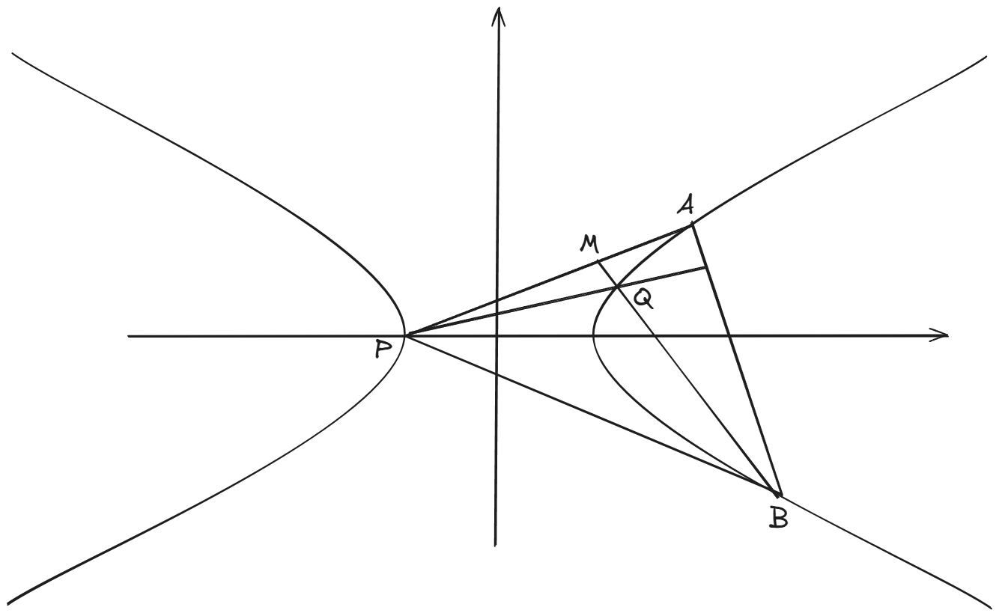

<h1>专题练习_圆锥曲线_3</h1>

> *本次专题练习是针对双曲线而写的*
>
> *椭圆和双曲线尽管在图像上差别很大，但是它们的性质是对称的。椭圆中成立的结论，一般在双曲线中也成立。因此，下面的题目中，我会倾向于选择那些与双曲线特有的性质相关的题目，涵盖了**等轴双曲线**、**焦点三角形的内切圆**、**双曲线的渐近线**这三个元素。*

## 题一

已知等轴双曲线 $\Pi$ 的左顶点为 $P$ ，$AB$ 是双曲线右支的一条弦，过 $P$ 作 $AB$ 的垂线，与 $\Pi$ 交于 $Q$ 。

证明：$Q$ 是 $\triangle PAB$ 的垂心。

*注：*

- *等轴双曲线指的是长轴和短轴长度相等的双曲线*。
- $\Pi$ *是希腊字母 $\pi$ 的大写形式。除了用作取名，它还是**求积符号***：$\Pi_{i=1}^na_i=a_1a_2a_3\dots a_n$ 。

-----------------------------------------

**解析：**

​	不妨设双曲线 $\Pi$ 的方程为 $x^2-y^2=a^2$ 。

​	如上图所示，我们要证明 $Q$ 是垂心。既然现在 $Q$ 已经位于一条垂线上了，那么我们只需要证明它位于另一条垂线上。例如，过 $B$ 作垂线 $BM$ ，我们去证明 $BM$ 经过 $Q$ 点就可以了，而要做到这件事，我们需要求出 $Q$ 点坐标和 $BM$ 的方程。

​	首先求 $Q$ 点坐标，为此，需要求出 $P$ 对 $AB$ 的垂线，并与双曲线联立。而要求 $AB$ 的垂线还需要 $AB$ 的方程，这里我们使用设线法，直接设 $AB$ 的方程为 $x = my + t$ ，注意这里反设方程，是为了避免讨论 $AB$ 垂直于 $x$ 轴的情况…….我们之前是这么说的，然而在本题中这样做并没有效果，看下面：

​	$P$ 点坐标为 $(-a,0)$ ，它关于 $AB$ 的垂线为 $x = -\frac{1}{m}y - a$ ，注意，这里显然要求 $m \neq 0$ ，但是 $m$ 是可以等于 $0$ 的，此时 $AB$ 垂直于 $x$ 轴。所以，即使我们反设 $AB$ 的方程，也不能避免分类讨论。当然这样的情况占少数，具体问题具体分析。这里我就不讨论垂直的情况了，直接看一般的情形，也就是 $m \neq 0$ 时。

​	联立垂线方程与双曲线方程 $x^2-y^2 = a^2$，得到：
$$
\begin{align*}
(\frac{1}{m^2}-1)y^2+\frac{2a}{m}y&=0\\
y =-\frac{2am}{1-m^2} \text{ or  } 0
\end{align*}
$$
​	其中， $y=0$ 这个解就是 $P$ 点，从而 $Q$ 点坐标为 $(\frac{a(1+m^2)}{1-m^2},-\frac{2am}{1-m^2})$ 。

​	接下来，我们只需要证明 $BQ \perp AP$ 即可，或者还有一种方法，就是先求出 $AP$ 的垂线 $BM$ ，然后证明 $BM$ 经过 $Q$ 点。两种方法其实差别不大，这里我们就采用前者。

​	设 $A(x_1,y_1), B(x_2,y_2)$ 。我们之前设出 $AB$ 方程后，还没有和双曲线联立得到韦达定理，这一步是设线法必不可少的，我们现在来写一下：
$$
\begin{align*}
(m^2-1)y^2+2mty+t^2-a^2&=0\\
y_1+y_2=\frac{2mt}{1-m^2}, y_1y_2=\frac{t^2-a^2}{m^2-1}
\end{align*}
$$
​	好了两分到手（其实这一步骤应该在设出 $AB$ 方程后马上就写好的）。然后求 $BQ$ 方程，也就是
$$
\begin{equation*}
 y = \frac{y_2+\frac{2am}{1-m^2}}{x_2-\frac{a(1+m^2)}{1-m^2}}(x-x_2)+y_2
\end{equation*}
$$
​	别看这么复杂，我们只需要它的斜率就够了。直线 $AP$ 的斜率是 $\frac{y_1}{x_1+a}$ ,下面只需要证明这两个斜率之积为 $-1$ 。
$$
\begin{align*}
\frac{y_2+\frac{2am}{1-m^2}}{x_2-\frac{a(1+m^2)}{1-m^2}}\cdot\frac{y_1}{x_1+a} &=\frac{y_1[y_2(1-m^2)+2am]}{(x_1+a)[x_2(1-m^2)-a(1+m^2)]}\\
&=\frac{(1-m^2)y_1y_2+2amy_1}{(my_1+t+a)[(my_2+t)(1-m^2)-a(1+m^2)]}\\
&=\frac{(1-m^2)y_1y_2+2amy_1}{(my_1+t+a)[m(1-m^2)y_2+t(1-m^2)-a(1+m^2)]}\\
&=\frac{(1-m^2)y_1y_2+2amy_1}{m^2(1-m^2)y_1y_2+m[t(1-m^2)-a(1+m^2)]y_1+m(t+a)(1-m^2)y_2+(t+a)[t(1-m^2)-a(1+m^2)]}

\end{align*}
$$
​	上面这个式子中，出现了 $y_1y_2$  ，它能用韦达定理来替换。然而 $y_1$ 和 $y_2$ 的系数不相等，我们不能用 $y_1+y_2$ 来替换。这里就是之前讲过的“非对称韦达定理”。处理方法是 ：用 $y_1y_2$ 去表示 $y_1+y_2$ 。

​	根据之前算出的韦达定理，可以得到 $y_1y_2 = \frac{2mt}{a^2-t^2}(y_1+y_2)$ ，我们把这个式子代入上式，得到：
$$
\begin{align*}
\frac{y_2+\frac{2am}{1-m^2}}{x_2-\frac{a(1+m^2)}{1-m^2}}\cdot\frac{y_1}{x_1+a} &= \frac{\frac{2mt(1-m^2)}{a^2-t^2}(y_1+y_2)+2amy_1}{\frac{2m^3t(1-m^2)}{a^2-t^2}(y_1+y_2)+m[t(1-m^2)-a(1+m^2)]y_1+m(t+a)(1-m^2)y_2+(t+a)[t(1-m^2)-a(1+m^2)]}\\
&=2m\cdot\frac{[t(1-m^2)+a(a^2-t^2)]y_1+t(1-m^2)y_2}{2m^3t(1-m^2)(y_1+y_2)+m(a^2-t^2)[t(1-m^2)-a(1+m^2)]y_1+m(a^2-t^2)(t+a)(1-m^2)y_2+(a^2-t^2)(t+a)[t(1-m^2)-a(1+m^2)]}\\
&=2m\cdot\frac{[t(1-m^2)+a(a^2-t^2)]y_1+t(1-m^2)y_2}{(2m^3t(1-m^2)+m(a^2-t^2)[t(1-m^2)-a(1+m^2)])y_1+(2m^3t(1-m^2)+m(a^2-t^2)(t+a)(1-m^2))y_2+(a^2-t^2)(t+a)[t(1-m^2)-a(1+m^2)]}\\
&=2m\cdot\frac{}{}

\end{align*}
$$

这道题目来源于下面这个美妙的定理，我作了简化，之前是直接把原定理作为题目，然而我做了之后发现难度太大。下面是之前写的解析，后面没有算完，但基本思路是一样的。

$A,B,C$ 是等轴双曲线 $\Pi$ 上的三点，证明：$\triangle ABC$ 的垂心也在 $\Pi$ 上。

**解析：**

​	

​	如上图所示，不妨设双曲线 $\Pi$ 的方程为 $x^2-y^2=a^2(a>0)$ 。

​	我们要证明这个三角形的垂心位于 $\Pi$ 上，所以需要求出两条垂线的交点坐标，并证明这个交点坐标满足双曲线的方程 $x^2-y^2=a^2$ 。

​	之前说过，椭圆和双曲线的题目一般用设线法。本题的三角形有三条边，那么我们应该设出哪一条边的直线方程呢？答案是**随便**。因为三条边的地位是等价的。不妨设 $AB$ 的方程为 $y=kx+m$ ，点 $A,B,C$ 的坐标分别为 $(x_1,y_1),(x_2,y_2),(x_3,y_3)$ 。注意，直线 $AB$ 是可以垂直 $x$ 轴的，当然也可以垂直 $y$ 轴，因此无论如何，都要分类讨论一下，这一步留给读者。下面的解析，主要叙述的是一般性的情况，也就是 $AB$ 不垂直于 $x$ 轴时。

​	接下来，我们求出 $A,B$ 到对边的垂线 $AM,BN$ ，那么两条垂线的交点就是垂心。但是在此之前，需要先把直线 $AB$ 和双曲线联立，求出韦达定理的两个式子。（不止一次地强调过，不管题目会不会做，这一步的两分是必须要拿到的）
$$
\begin{align*}
x^2 - (kx+m)^2&=a^2\\
(1-k^2)x^2-2kmx-m^2-a^2&=0
\end{align*}
$$
​	于是根据韦达定理，我们有
$$
\left\{
\begin{align*}
x_1+x_2 &= \frac{2km}{1-k^2}\\
x_1x_2 &= \frac{-m^2-a^2}{1-k^2}
\end{align*}
\right.
$$
​	 好了两分到手，~~可以做下一题了~~,然后我们首先求 $AM$ ，为此，需要先求出直线 $BC$ 的方程：
$$
\begin{equation*}
BC:y = \frac{y_2-y_3}{x_2-x_3}(x-x_2)+y_2
\end{equation*}
$$
​	先别急着求 $AM$ ，这里有个疑点：直线 $BC$ 也有可能垂直于 $x$ 轴！当然它也可能垂直于 $y$ 轴，所以这里又要分类讨论了……吗？其实不用，因为之前我们已经分类讨论过（虽然在这个解析里面没有写），当直线 $AB$ 垂直于 $x$ 轴的时候，题目的结论是成立的。现在你想一想，既然 $AB$ 垂直于 $x$ 轴的时候结论成立，那么 $BC$ 垂直于 $x$ 轴的时候结论是不是也一定成立？ $AC$ 垂直于 $x$ 轴的时候呢？这是当然的。**因为这三条边的地位是等价的**。所以这里就不需要分类讨论了。下面求 $AM$ 。
$$
\begin{equation*}
AM: y = \frac{x_3-x_2}{y_2-y_3}(x-x_1)+y_1
\end{equation*}
$$
​	好了，两条垂线求出了一条，还剩下一条 $BN$ 。那么我们还需要把上面求 $AM$ 的过程重复一遍吗？其实不需要，我们可以直接写出：
$$
\begin{equation*}
BN: y= \frac{x_3-x_1}{y_1-y_3}(x-x_2)+y_2
\end{equation*}
$$
​	为什么？其实很简单，还是利用 $AB,BC,CA$ 三条边地位等价这一事实。$AM$ 是 $B(x_2,y_2)$$C(x_3,y_3)$ 边上的垂线，它经过 $A(x_1,y_1)$；$BN$ 是 $A(x_1,y_1),C(x_3,y_3)$ 边上的垂线，它经过 $B(x_2,y_2)$ 。比较一下，我们只需要把 $B$ 和 $A$ 换个位置就行了，也就是把 $AM$ 方程中的 $x_2$ 换成 $x_1$ ，$x_1$ 换成 $x_2$，$y_2$ 换成 $y_1$，$y_1$ 换成 $y_2$ ，就能得到直线 $BN$ 的方程。如果是考试，答题卡上就写一个 **同理** ，然后直接把 $BN$ 方程美美写出来。**同理**这个东西是各种数学证明的常客，在高中阶段，我们只在像本题这样有明显规律和对称性的情况下使用。

​	好了，下面求 $AM$ 和 $BN$ 的交点，也就是我们心心念念的垂心，不妨给它取个名字叫做 $P$ 。$P$ 是 *point* 的首字母，常用来给点取名。

​	 联立
$$
\left\{
\begin{align*}
y &= \frac{x_3-x_2}{y_2-y_3}(x-x_1)+y_1\\
y &= \frac{x_3-x_1}{y_1-y_3}(x-x_2)+y_2
\end{align*}

\right.
$$
​	解得 $P$ 点坐标为
$$
\left\{
\begin{align*}
x_P &= \frac{y_2-y_1+\frac{x_1(x_3-x_2)}{y_2-y_3}-\frac{x_2(x_3-x_1)}{y_1-y_3}}{\frac{x_3-x_2}
{y_2-y_3}-\frac{x_3-x_1}{y_1-y_3}}\\
&=\frac{(y_2-y_1)(y_2-y_3)(y_1-y_3)+x_1(x_3-x_2)(y_1-y_3)-x_2(x_3-x_1)(y_2-y_3)}{(x_3-x_2)(y_1-y_3)-(x_3-x_1)(y_2-y_3))}\\
&=\frac{k(x_2-x_1)(kx_2+m-y_3)(kx_1+m-y_3)+x_1(x_3-x_2)(kx_1+m-y_3)-x_2(x_3-x_1)(kx_2+m-y_3)}{(x_3-x_2)(kx_1+m-y_3)-(x_3-x_1)(kx_2+m-y_3)}\\
&=\frac{k(x_2-x_1)[k^2x_1x_2+k(m-y_3)(x_1+x_2)+(m-y_3)^2]+k[(x_1-x_2)(x_3(x_1+x_2)-x_1x_2)]+x_3(m-y_3)(x_1-x_2)}{(kx_3+m-y_3)(x_1-x_2)}\\
&=\frac{k(x_2-x_1)[k^2\cdot\frac{-m^2-a^2}{1-k^2}+k(m-y_3)\cdot\frac{2km}{1-k^2}+(m-y_3)^2]+k[(x_1-x_2)(x_3\cdot\frac{2km}{1-k^2}+\frac{m^2+a^2}{1-k^2})]+x_3(m-y_3)(x_1-x_2)}{(kx_3+m-y_3)(x_1-x_2)}\\
&=\frac{k(x_2-x_1)[-k^2m^2-k^2a^2+2k^2m^2-2k^2my_3+(1-k^2)(m-y_3)^2]+k(x_1-x_2)(2kmx_3+m^2+a^2)+x_3(1-k^2)(m-y_3)(x_1-x_2)}{(1-k^2)(kx_3+m-y_3)}\\
&=\frac{[k^3m^2+k^3a^2-2k^3m^2+2k^3my_3+k^3m^2-2k^3my_3+k^3y_3^2-km^2+2kmy_3-ky_3^2+2k^2mx_3+km^2+ka^2+mx_3-x_3y_3-k^2mx_3+k^2x_3y_3]}{(1-k^2)(kx_3+m-y_3)}\\
&=\frac{[k^3(m^2+a^2-2m^2+2my_3+m^2-2my_3+y_3^2)+k^2(2mx_3-mx_3+x_3y_3)+k(-m^2+2my_3-y_3^2+m^2+a^2)+mx_3-x_3y_3]}{(1-k^2)(kx_3+m-y_3)}\\
&=\frac{[(a^2+y_3^2)k^3+x_3(m+y_3)k^2+(2my_3-y_3^2+a^2)k+mx_3-x_3y_3]}{(1-k^2)(kx_3+m-y_3)}\\
&=

\end{align*}
\right.
$$

​	上面的公式貌似只有在线浏览能看全，PDF版只能看到一部分，因为太长了。

​	计算量实在很大，连我都坚持不下去。

## 题2

已知双曲线 $C:\frac{x^2}{a^2}-\frac{y^2}{b^2} = 1(a>0,b>0)$ 的左、右顶点分别为 $A,B$ ，点 $D(3,\sqrt{2})$ 在 $C$ 上，且直线 $AD$ 与 $BD$ 的斜率之和为 $\sqrt{2}$ 。

（1）求双曲线 $C$ 的方程

（2）过点 $P(3,0)$ 的直线与 $C$ 交于 $M,N$ 两点（均异于点 $A,B$ ），直线 $MA$ 与直线 $x=1$ 交于点 $Q$ ，求证： $B,N,Q$ 三点共线

------------------------------------

**解析:**

​	（1）略，求出来双曲线的方程为 $\frac{x^2}{3}-y^2=1$ 。

​	（2）首先，画出图像如下：

​	这道题目方法不止一种，先讲最经典的**设线法**：

​	首先理出本题的逻辑链：我们要证明的是$B,N,Q$ 三点共线，那么肯定要把这三点的坐标都求出来，或者设出来。其中点 $B$ 是已知的，那么我们只需要 $N,Q$ 的坐标，而 $Q$ 点是直线 $MA$ 与直线 $x=1$ 的交点，所以如果要求 $Q$ 点坐标，就需要求出直线 $MA$ ，而 $A$ 点是已知的，所以我们需要点 $M$ 的坐标。再加上之前的 $N$ 点坐标，总而言之我们就需要直线 $MN$ ，因此就设出 $MN$ 方程。

​	实际上，即使不做上面的思维体操，也很容易知道要设直线 $MN$ 的方程（至于原因，在之前提及很多次了，在这里，$MN$ 是构建整个图形的驱动，从作图顺序上看，也是先画出 $MN$ 再有后面那些有的没的）。设出 $MN$ 方程，也就相当于得到了 $M,N$ 的坐标（因为我们要把 $MN$ 和双曲线联立）。

​	思路已经理清，之后就是纯粹的计算。本题的计算量不算大，

​	设 $MN$ 的方程为 $x=my+3$ ，$M,N$ 的坐标分别为 $(x_1,y_1),(x_2,y_2)$ ，与双曲线联立：
$$
\begin{align*}
(my+3)^2-3y^2 &= 3\\
(m^2-3)y^2+2mty+6 &=0 \\
y_1+y_2=\frac{6m}{3-m^2},y_1y_2=\frac{6}{m^2-3}
\end{align*}
$$
​	直线 $AM$ 的方程为： 
$$
y = \frac{y_1}{x_1+\sqrt{3}}(x+\sqrt{3})
$$
​	令 $x=1$ ，得到点 $Q$ 的坐标为 $(1,\frac{(1+\sqrt{3})y_1}{x_1+\sqrt{3}})$ 。

​	下面证明 $N,B,Q$ 三点共线。也就是证明 $k_{BQ} = k_{BN}$ 。
$$
\begin{align*}
k_{BQ} &= k_{BN}\\
\frac{(1+\sqrt{3})y_1}{(1-\sqrt{3})(x_1+\sqrt{3})} &= \frac{y_2}{x_2-\sqrt{3}}\\
(1+\sqrt{3})(my_2+3-\sqrt{3})y_1 &= (1-\sqrt{3})(my_1+3+\sqrt{3})y_2----\text{把x换成y}\\
(1+\sqrt{3})(3-\sqrt{3})y_1+(\sqrt{3}-1)(3+\sqrt{3})y_2+2\sqrt{3}my_1y_2&=0\\
\end{align*}
$$
​	现在，根据之前求出的韦达定理，可以得到：$y_1y_2 = -\frac{y_1+y_2}{m}$ ，代入上式得到
$$
\begin{align*}
2\sqrt{3}(y_1+y_2)-2\sqrt{3}(y_1+y_2)&=0\\
0&=0
\end{align*}
$$
​	所以，命题成立。

​	

​	下面，再给出一种使用**定比点差**的方法：

​	在前两次的专题练习中介绍过所谓的定比点差法，这种技术是专门用来解决定比分弦的问题的，具体而言，就是已知圆锥曲线的一条弦，并且这条弦被一个点分成一定比例的两段。在本题中，并没有这样的条件，但是我们可以自己创造一个定比分弦的条件。

​	在刚才的设线法中，我们是先求出 $Q$ 点坐标，然后证明 $N,B,Q$ 三点共线。为了能够应用定比分弦技术，我们需要对这种证明思路做一个调整：现在我们假设直线 $NB$ 与直线 $MA$ 交于点 $Q'$ ，然后我们去证明 $Q’$ 位于直线 $ x=1$ 上，换句话说就是证明 $Q’$ 和 $Q$ 是重合的。这种证明思路在初中的平面几何中经常使用。

​	现在可以开始正式的证明：

​	首先，需要创造出定比分弦的条件：设 
$$
\begin{align*}
\overrightarrow{QM} = \lambda \overrightarrow{QA} \\
\overrightarrow{QN} = \mu \overrightarrow{QB}
\end{align*}
$$
​	这样一来， $Q$ 点就把弦 $MA$ 和 $NB$ 分成了一定比例的两段。注意，即使 $Q$ 点在弦 $NB$ 的外面，我们也可以说它把 $NB$ 分成了两段。用射影几何的术语来描述的话，我们称 $Q$ 点是线段 $NB$ 的**外分点**，是线段 $MA$ 的**内分点**。

​	设点 $Q$ 坐标为 $(x_0,y_0)$ ，点 $M,N$ 的坐标分别为 $(x_1,y_1)$，$(x_2,y_2)$ ，根据上面两个向量等式，可以得到：
$$
\begin{align*}
x_1-x_0&=\lambda (-\sqrt{3}-x_0)\\
y_1-y_0&=\lambda(0-y_0)\\
x_2-x_0&=\mu(\sqrt{3}-x_0)\\
y_2-y_0&=\mu(0-y_0)
\end{align*}
$$
​	整理得到
$$
\begin{align*}
x_1&=(1-\lambda)x_0-\sqrt{3}\lambda\\
y_1&=(1-\lambda)y_0\\
x_2&=(1-\mu)x_0+\sqrt{3}\mu\\
y_2&=(1-\mu)y_0
\end{align*}
$$
​	从上面的式子中，凑出 $M,N$ 坐标相加与相减的形式。（因为点差法作差之后会出现平方差）
$$
\begin{align*}
\frac{x_1}{1-\lambda}-\frac{x_2}{1-\mu}&=\frac{\sqrt{3}\lambda}{\lambda-1}+\frac{\sqrt{3}\mu}{\mu-1}\\
\frac{x_1}{1-\lambda}+\frac{x_2}{1-\mu}&=2x_0+\frac{\sqrt{3}\lambda}{\lambda-1}+\frac{\sqrt{3}\mu}{1-\mu}\\
\frac{y_1}{1-\lambda}-\frac{y_2}{1-\mu}&=0\\
\frac{y_1}{1-\lambda}+\frac{y_2}{1-\mu}&=2y_0
\end{align*}
$$
​	之所以系数是 $\frac{1}{1-\lambda}$ 和 $\frac{1}{1-\mu}$ ，是因为要使得 $\frac{y_1}{1-\lambda}-\frac{y_2}{1-\mu}=0$ ，这样一来的话，在定比点差之后的式子里面就不会含有 $y$ ，你马上就会知道：

​	下面就可以使用定比点差法了，
$$
\begin{align*}
\frac{x_1^2}{3}-y_1^2 &= 1\\
\frac{x_2^2}{3}-y_2^2 &= 1\\
\end{align*}
$$
​	我们把 $(1)$ 乘以 $(\frac{1}{1-\lambda})^2$ ，把 $(2)$ 乘以 $(\frac{1}{1-\mu})^2$ ，得到：
$$
\begin{align*}
\frac{(\frac{x_1}{1-\lambda})^2}{3}-(\frac{y_1}{1-\lambda})^2 &=(\frac{1}{1-\lambda})^2\\
\frac{(\frac{x_2}{1-\mu})^2}{3}-(\frac{y_2}{1-\mu})^2 &= (\frac{1}{1-\mu})^2\\
\end{align*}
$$
​	把这两个式子相减，注意第二项为 $0$ ，这就是为什么系数是这样的
$$
\begin{align*}
\frac{(\frac{x_1}{1-\lambda}-\frac{x_2}{1-\mu})(\frac{x_1}{1-\lambda}+\frac{x_2}{1-\mu})}{3}-(\frac{y_1}{1-\lambda}-\frac{y_2}{1-\mu})(\frac{y_1}{1-\lambda}+\frac{y_2}{1-\mu})&=(\frac{1}{1-\lambda})^2-(\frac{1}{1-\mu})^2\\
(\frac{\sqrt{3}\lambda}{\lambda-1}+\frac{\sqrt{3}\mu}{\mu-1})(2x_0+\frac{\sqrt{3}\lambda}{\lambda-1}+\frac{\sqrt{3}\mu}{1-\mu})&=3(\frac{1}{1-\lambda})^2-3(\frac{1}{1-\mu})^2\\
\end{align*}
$$

​	好，这个式子看起来化简不了，我们先放着，后面再用。

​	题目还有一个条件：直线 $MN$ 过点 $(3,0)$ 。还记得我们之前求出的 $M,N$ 坐标吗？不用翻上去看，我把它搬过来：
$$
\begin{align*}
x_1&=(1-\lambda)x_0-\sqrt{3}\lambda\\
y_1&=(1-\lambda)y_0\\
x_2&=(1-\mu)x_0+\sqrt{3}\mu\\
y_2&=(1-\mu)y_0
\end{align*}
$$

​	于是，直线 $MN$ 的方程即为： $y=\frac{(\lambda-\mu)y_0}{(\lambda-\mu)x_0+\sqrt{3}(\lambda+\mu)}(x-(1-\lambda)x_0+\sqrt{3}\lambda)+(1-\lambda)y_0$，它过点 $(3,0)$ ，于是令 $x=3,y=0$ ，得到
$$
\begin{align*}
 \frac{(\lambda-\mu)y_0}{(\lambda-\mu)x_0+\sqrt{3}(\lambda+\mu)}(3-(1-\lambda)x_0+\sqrt{3}\lambda)+(1-\lambda)y_0 &= 0\\
(\lambda-\mu)(3-(1-\lambda)x_0+\sqrt{3}\lambda)+[(\lambda-\mu)x_0+\sqrt{3}(\lambda+\mu)](1-\lambda)&=0\\
(\lambda+\mu)(1-\lambda)+\sqrt{3}(\lambda-\mu)+\lambda(\lambda-\mu)&=0\\
\frac{1+\sqrt{3}}{1-\lambda}+\frac{1-\sqrt{3}}{1-\mu}&=2\\
\frac{1}{1-\lambda}&=\frac{(\sqrt{3}-1)(1+\sqrt{3}-2\mu)}{2(1-\mu)}
\end{align*}
$$
​	现在回到之前定比点差得到的式子：
$$
(\frac{\sqrt{3}\lambda}{\lambda-1}+\frac{\sqrt{3}\mu}{\mu-1})(2x_0+\frac{\sqrt{3}\lambda}{\lambda-1}+\frac{\sqrt{3}\mu}{1-\mu})=3(\frac{1}{1-\lambda})^2-3(\frac{1}{1-\mu})^2\\
\begin{align*}
x_0 &= \frac{3(\frac{1}{1-\lambda})^2-3(\frac{1}{1-\mu})^2-3[(\frac{\lambda}{\lambda-1})^2-(\frac{\mu}{\mu-1})^2]}{2\sqrt{3}(\frac{\lambda}{\lambda-1}+\frac{\mu}{\mu-1})}\\
&=\frac{\sqrt{3}}{2}\cdot \frac{\frac{1+\lambda}{1-\lambda}-\frac{1+\mu}{1-\mu}}{\frac{\lambda}{\lambda-1}+\frac{\mu}{\mu-1}}
\end{align*}
$$
​	把之前算出的 $\lambda$ 与 $\mu$ 的关系代入上式，化简后即得 $x_0=1$ 。这就证明了 $Q’$ 位于 $x=1$ 上。

