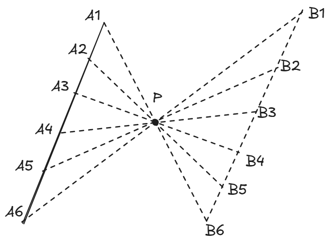
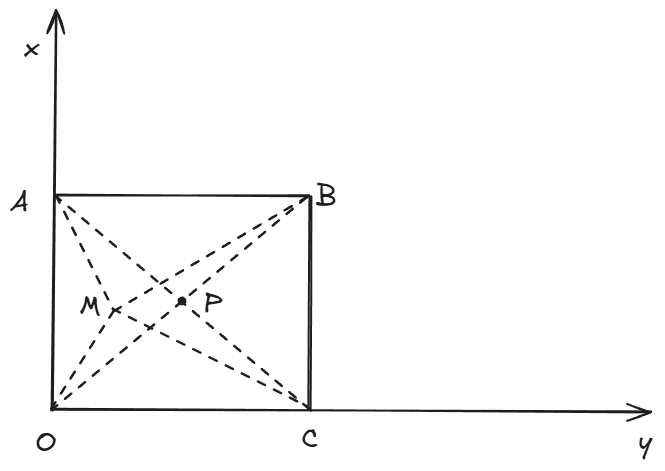

 <h1>专题练习_直线与圆_1 </h1> 

## 题1

平面直角坐标系中，设直线$l:x+y=1,$圆$O(x-4)^2+(y-4)^2=1$，动点$P$在直线$l$ 上运动。过点$P$做圆$O$的两条切线，切点分别为$A, B$，则四边形$OAPB$的面积的最小值为$\underline{}\underline{}\underline{}\underline{}\underline{}\underline{}\underline{}$

> 答案：$\sqrt{6}$

**解析：**

​	

​	如上图所示，容易知道四边形$OAPB$的面积就是三角形$OBP$面积的两倍，也就是$S_{OAPB}=OB \times PB = \sqrt{OP^2-1}$ 。所以，只需要求$OP$的最小值，即点$O$到直线$l$的距离。

## 题2

平面直角坐标系中，设圆$O：x^2+y^2=1$，点$A(0,1)$，$B(0,-1)$。过$A$做圆$O$的一条切线的垂线，垂足为$P$。问$|PB|$的最大值为？

> 答案：$\frac{4\sqrt{3}}{3}$

**解析：**

​	

​	如上图所示，我们的目的很明确：求出$P$点坐标。$P$是一个动点，它的坐标能用参变量来表示，或者能用轨迹方程来刻画，**这是动点问题亘古不变的解题原则。**

​	那么怎么求出$P$的坐标？它是切线和直线$PA$的交点，而直线$PA$是切线的垂线，如果知道切线方程，直线$PA$的方程就能求出(利用斜率相乘等于-1)，从而联立两条直线方程，就能求出交点$P$。

​	我们知道，单位圆的切线到圆心的距离为1，所以可以把切线方程设为$\cos{\theta} \cdot x + \sin{\theta} \cdot y = 1$，或者写成$y = -\frac{\cos{\theta}}{\sin{\theta}} \cdot x + \frac{1}{\sin{\theta}}$，这里的$\theta$是变量。从而直线$PA$的方程就是$y = \frac{\sin{\theta}}{\cos{\theta}} \cdot x + 1$，联立它们，就能得到$P$ 的坐标：

​	$$ P(\cos{\theta}-\sin{\theta}\cos{\theta} \quad, \quad \sin{\theta}+cos^2\theta) $$

​	最后就是求$|PB|$了，可以预见得到的结果是一个关于$\theta$的函数，利用必修一学习的三角恒等变换可以求出其最小值，**过程略**。

​	顺便说下，本题中P点的轨迹是这样子的。这是一条**心形线** 。

​	

## 题3

（2021-北京）已知直线 $y=kx+m$（$m$为常数）与圆 $x^2+y^2=4$交于点$M,N$，当 $k$ 变化时，若$|MN|$的最小值为 $2$，则 $m=$（   ）

$A.1$或$-1$    $B.\sqrt{2}$或$-\sqrt{2}$       $C.\sqrt{3}$或$-\sqrt{3}$      $D.2$或$-2$

> 答案：$C$

**解析：**

​	$|MN|$是弦长，我们知道圆的弦长公式为
$$
l = 2 \cdot \sqrt{R^2-d^2}
$$
​	其中，$l$是弦长，$R$是圆的半径，$d$是圆心到弦的距离（圆心距）。

​	既然弦长$|MN|$的最小值为$2$，说明圆心距$d$的最大值为$\sqrt{3}$，也就是圆心$(0,0)$到直线 $y=kx+m$的距离最大值为$\sqrt{3}$。
$$
d = \frac{|m|}{\sqrt{k^2+1}} \leq |m| = \sqrt{3}
\\
m=\sqrt{3} 或-\sqrt{3}
$$

## 题4

（2020-全国）已知圆 $M: x^2+y^2-2x-2y-2=0$，直线$l: 2x+y+2=0$，$P$ 为 $l$ 上的动点，过点 $P$ 做圆 $M$的切线 $PA,PB$，切点为 $A,B$，当 $|PM| \cdot |AB|$最小时，直线 $AB$的方程为（    ）

$A. 2x-y-1=0$      $B.2x+y-1=0$       $C.2x-y+1=0$   $D.2x+y+1=0$

> 答案：$D$

**解析：**

​	这道题和[题1](#题1)是不是一模一样？注意四边形$PAMB$是我们在初中就学过的筝形，它的面积就等于$|PM|\cdot|AB|$

## 题5

（2020-山东）直线 $2x+3y-6=0$关于点 $(-1,2)$对称的直线方程是（    ）

$A. 3x-2y-10=0$      $B.3x-2y-23=0$      $C.2x+3y-4=0$        $D.2x+3y-2=0$

>  答案：$D$

**解析：**

​	直线与圆这一章有几个与对称有关的考点，列举如下：

- 点关于点对称
- 点关于线对称
- 线关于点对称
- 圆关于点对称
- 圆关于线对称

​	其实，所有的这些对称，本质上都是点关于点对称。

​	本题就是线关于点对称。想象一条直线，它上面有无数个点，我们给每个点做关于对称中心$P$的对称点，那么所有的对称点就连成了一条直线，也就是线关于点的对称直线。下面是一个示意图：

​	是不是很直观？现在的问题是，我们已经知道了直线$l$的方程$2x+3y-6=0$，以及对称中心$P(-1,2)$，我们怎么求出对称直线$l'$呢？

​	刚才的思想是，我们对直线$l$上面无数个点都做对称点，但是在实际操作时，我们往往只在直线$l$上取一个点$(m,n)$作为这无数个点的**代表**。

​	取$2x+3y-6=0$上面一个点$(m,n)$，它满足$2m+3n-6=0$，然后求出$(m,n)$关于$P(-1,2)$的对称点为 $(-2-m,4-n)$ ，下面是**关键**：既然$(m,n)$是直线$l$的一个代表点，那么 $(-2-m,4-n)$就应该是对称直线$l'$的一个代表点，也就是说，我们把$-2-m$和$4-n$分别看成整体$p,q$，得到 $m=-2-p,n=4-q$，代入$2m$$+3n-6$$=0$中，解得 $2p+3q-2=0$，所以对称直线$l'$的方程就是 $2p+3q-2=0$，习惯上写作 $2x+3y-2=0$。

​	**注：**对于圆关于点对称，以及圆关于线对称，比上面的线关于点对称要简单很多，因为我们要确定一个圆，只需要确定圆心和半径就行了。一个圆关于点/线的对称圆，它们的半径是一样的，**所以只需要把圆心做对称点就行了**。如下图所示

## 题6

若直线 $(a+2)x+(1-a)y-3=0$与直线 $(a-1)x+(2a+3)y+2=0$互相垂直，则$a$的值为（    ）

$A. 1$      $B.-1$     $C.1$或$-1$         $D.-\frac{3}{2}$

> 答案：$C$	

**解析：**

​	这道题目，无论是把直线方程转化为$y = kx + b$形式还是转化为$x=my+t$形式都会涉及到分类讨论，比较麻烦。究其本质，是因为这两种形式都**不能表达所有方向的直线**，例如前一种形式不能表达垂直于$x$轴的直线，后一种形式不能表达垂直于$y$轴的直线。

​	那么，有没有一种方法，能表达出直线的所有方向？答案是使用**法向量** 。

​	熟悉空间向量的同学们对平面的法向量不陌生，那么直线的法向量是什么意思呢？顾名思义，**就是和直线垂直的向量。**形式为$Ax+By+C=0$的直线，它的法向量是$(A,B)$。例如直线$x+y-1=0$，它的法向量是$(1,1)$，大家可以自行验证，向量$(1,1)$的方向是不是和$x+y-1=0$这条直线垂直。

​	法向量可以表达出直线的所有方向，例如和$x$轴垂直的直线$x - 1 = 0$，它的法向量是$(1,0)$，和$y$轴垂直的直线$y+1=0$，它的法向量是$(0,1)$。

​	和平面的法向量一样，有了直线的法向量，我们就可以对直线的平行和垂直进行刻画。

- 两条直线垂直，等价于法向量垂直
- 两条直线平行，等价于法向量平行

​	再来看本题，两条直线的法向量分别为$(a+2,1-a)$和$(a-1,2a+3)$，这两个法向量垂直，从而数量积为$0$，

即$(a+2)(a-1)+(1-a)(2a+3)=0$，解得$a=1$或$-1$。你看，避免了分类讨论，是不是很简单？

## 题7

过点$A(1,2)$且与两定点$(2,3),(4,-5)$等距离的直线方程为$\underline{}\underline{}\underline{}\underline{}\underline{}$

> 答案：$3x+2y-7=0$或$4x+y-6=0$

**解析：**

​	稍微在脑海中想一想就知道，和两个定点等距离，要么就和这两个定点连成的直线平行，要么就经过这两个定点的连线的中心，如下

我曾经遇到过一个立体几何题：

>  平面$\alpha$内存在不共线的三个点到平面$\beta$的距离相等，则$\alpha \parallel \beta$

这个命题是对还是错呢？仔细想想，是不是和题7很像！不过我当时居然想了很久才想明白~~

## 题8

对任意实数$m$，直线$x+my-3m-4=0$被圆$C$截得的线段长恒为$4$，若动点$P$在圆$C$上，则点$P$到原点距离的最小值是$\underline{}\underline{}\underline{}\underline{}\underline{}$

> 答案：3

**解析：**

​	看到$x+my-3m-4=0$这样一个带参数的直线方程，**马上就要想到它过一个定点**。我们把参数$m$提取出来，$x+m(y-3)-4=0$，很明显它经过定点$(4,3)$。现在题目要求这条直线被圆截得的线段长恒定，也就是弦长恒定。什么时候才会出现这种情况？**当然就是直线经过的定点$(4,3)$恰好是圆心的时候了**，此时不管直线如何旋转，弦长都是恒定的直径。否则的话，直线稍微一旋转，弦长就会改变。

## 题9

设$0 \leq x \leq 1,0\leq y \leq 1$，令$S=\sqrt{x^2+y^2}+\sqrt{(x-1)^2+y^2}+\sqrt{x^2+(y-1)^2}+\sqrt{(x-1)^2+(y-1)^2}$，则$S$的最小值为$\underline{}\underline{}\underline{}\underline{}\underline{}\underline{}$

>  答案：$2\sqrt{2}$

**解析：**

​	数学里面求代数式的最值，无非两种方法：**代数法**和**几何法**。

- 几何法：

  观察$S$的形式，我们发现这四个根号可以看成点$(x,y)$到$(0,0),(0,1),(1,0),(1,1)$的距离之和。

  如下图，正方形$OABC$边长为$1$，点$M(x,y)$在正方形内部（包括边界），我们要求的式子$S$就等于$MO+MA+MB+MC$。由于
  $$
  MO+MA+MB+MC = (MA+MC)+(MO+MB)\geq AC+OB=2\sqrt{2}
  $$
  其中用到了**三角形两边之和大于第三边**，或者称为**三角不等式**。当且仅当点$M$位于对角线交点时取=。

   

- 代数法：

  使用柯西不等式的变式：
  $$
  \sqrt{x^2+y^2}+\sqrt{(1-x)^2+y^2}+\sqrt{x^2+(y-1)^2}+\sqrt{(1-x)^2+(y-1)^2}\\ \geq\sqrt{(x+1-x+x+1-x)^2+(y+1-y+y+1-y)^2}= 2\sqrt{2}
  $$
  (注意我把$x-1$和$y-1$写成了$1-x$和$1-y$）。当且仅当$x=y=\frac{1}{2}$时取等。

**注：**柯西不等式变式：
$$
对任意正整数n\geq2以及非零实数x_i,y_i(i=1,2,3\cdot\cdot\cdot n),有\\
\sqrt{x_1^2+y_1^2}+\sqrt{x_2^2+y_2^2}+\cdot\cdot +\sqrt{x_n^2+y_n^2}\geq \sqrt{(x_1+x_2+\cdot\cdot+x_n)^2 + (y_1+y_2+\cdot\cdot+y_n)^2} \\
当且仅当\frac{x_1}{y_1}=\frac{x_2}{y_2}=\cdot\cdot\cdot=\frac{x_n}{y_n}时取等。
$$
