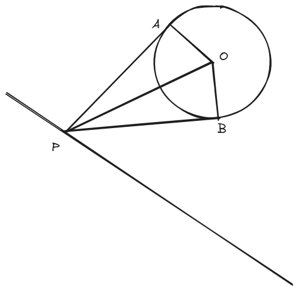

 <h1>专题练习_直线与圆_1 </h1> 

## 题1

​	平面直角坐标系中，设直线$l:x+y=1,$圆$O(x-4)^2+(y-4)^2=1$，动点$P$在直线$l$ 上运动。过点$P$做圆$O$的两条切线，切点分别为$A, B$，则四边形$OAPB$的面积的最小值为$\underline{}\underline{}\underline{}\underline{}\underline{}\underline{}\underline{}$

> 答案：$\sqrt{6}$

**解析：**

​	
