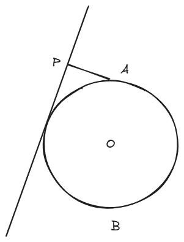

 <h1>专题练习_直线与圆_1 </h1> 

## 题1

​	平面直角坐标系中，设直线$l:x+y=1,$圆$O(x-4)^2+(y-4)^2=1$，动点$P$在直线$l$ 上运动。过点$P$做圆$O$的两条切线，切点分别为$A, B$，则四边形$OAPB$的面积的最小值为$\underline{}\underline{}\underline{}\underline{}\underline{}\underline{}\underline{}$

> 答案：$\sqrt{6}$

**解析：**

​	

​	如上图所示，容易知道四边形$OAPB$的面积就是三角形$OBP$面积的两倍，也就是$S_{OAPB}=OB \times PB = \sqrt{OP^2-1}$ 。所以，只需要求$OP$的最小值，即点$O$到直线$l$的距离。

## 题2

​	平面直角坐标系中，设圆$O：x^2+y^2=1$，点$A(0,1)$，$B(0,-1)$。过$A$做圆$O$的一条切线的垂线，垂足为$P$。问$|PB|$的最大值为？

> 答案：$\frac{4\sqrt{3}}{3}$

**解析：**

​	

​	如上图所示，我们的目的很明确：求出$P$点坐标。$P$是一个动点，它的坐标能用参变量来表示，或者能用轨迹方程来刻画，**这是动点问题亘古不变的解题原则。**

​	那么怎么求出$P$的坐标？它是切线和直线$PA$的交点，而直线$PA$是切线的垂线，如果知道切线方程，直线$PA$的方程就能求出(利用斜率相乘等于-1)，从而联立两条直线方程，就能求出交点$P$。

​	我们知道，单位圆的切线到圆心的距离为1，所以可以把切线方程设为$\cos{\theta} \cdot x + \sin{\theta} \cdot y = 1$，或者写成$y = -\frac{\cos{\theta}}{\sin{\theta}} \cdot x + \frac{1}{\sin{\theta}}$，这里的$\theta$是变量。从而直线$PA$的方程就是$y = \frac{\sin{\theta}}{\cos{\theta}} \cdot x + 1$，联立它们，就能得到$P$ 的坐标：

​	$$ P(\cos{\theta}-\sin{\theta}\cos{\theta} \quad, \quad \sin{\theta}+cos^2\theta) $$

​	最后就是求$|PB|$了，可以预见得到的结果是一个关于$\theta$的函数，利用必修一学习的三角恒等变换可以求出其最小值，**过程略**。