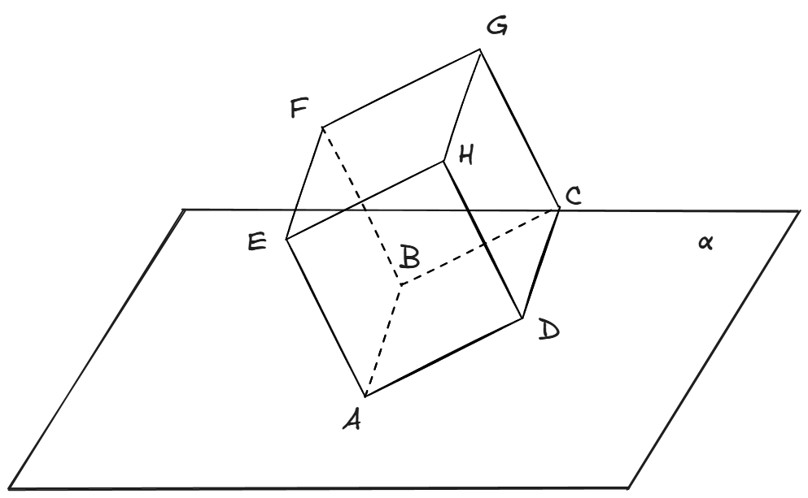

<h1>空间向量_1</h1>

## 题1

空间直角坐标系中有正方体 $ABCD-A_1B_1C_1D_1$ ，其中 $A(1,2,3),B(4,5,6),C(5,6,4)$ ，则 $D_1$ 坐标的**所有**可能取值为 $\underline{}\underline{}\underline{}\underline{}\underline{}\underline{}$  

> **答案：** $(2+\frac{3\sqrt{6}}{2},3-\frac{3\sqrt{6}}{2},1)$ 或 $(2-\frac{3\sqrt{6}}{2},3+\frac{3\sqrt{6}}{2},1)$ 

----------------------------------

**解析：**

​	这道题目，如果在空间直角坐标系中画出这个正方体，从几何角度求解，是比较困难的。事实上，$A,B,C$ 三点是已知的，由于(不共线的)三点确定一个平面，所以这个正方体的底面正方形已经确定，根据 $\overrightarrow{AD} \parallel \overrightarrow{BC}$ 可以求出 $D$ 点坐标为 $(2,3,1)$ 。而正方形 $A_1B_1C_1D_1$ 既可以在正方形 $ABCD$ 的上面又可以在下面，从而 $D_1$ 的坐标有两种情况。下面我们来求 $D_1$ 的坐标：设 $D_1(a,b,c)$ ，根据 $DD_1 \perp$ 平面$ABCD$ ，可以得到 $DD_1 \perp AB, $ $DD_1 $$\perp BC$ ，转换成数量积等于 $0$ ，就有：
$$
\left\{
\begin{align*}
3(a-2) + 3(b-3) + 3(c-1) &= 0\\
a-2 + b-3 -2(c-1) &= 0
\end{align*}
\right.
$$
​	上面有三个未知数，然而只有两个方程。我们还有什么条件没用到？上面的方程组是刻画垂直关系的，显然 $DD_1$ 不光要垂直于平面 $ABCD$ ，而且 $|DD_1| = |AB| = 3\sqrt{3}$ ，所以还有一个刻画长度的方程：
$$
\begin{equation*}
\sqrt{(a-2)^2+(b-3)^2+(c-1)^2}=3\sqrt{3}
\end{equation*}
$$
​	这样，根据上面三个方程就能求出 $a,b,c$ 。

## 题2

已知正方体 $ABCD-A_1B_1C_1D_1$ 的棱长为 $1$ ，点 $P$、$Q$ 分别是直线 $A_1D$ 和直线 $BD_1$ 上的动点。则 $|PQ|$ 的最小值为 $\underline{}\underline{}\underline{}\underline{}\underline{}\underline{}$

> **答案：** $\frac{\sqrt{6}}{6}$

---------------------------

**解析：**

​	这道题目的本质是所谓**异面直线的公垂线段**。我会先给出一个使用**空间直线的参数方程**的方法，再略微解释何为公垂线段。

​	本题有两个动点 $P,Q$ ,分别位于两条直线上。我们要求 $|PQ|$ ，那么自然想要把 $P,Q$ 的坐标求出来，这就要利用它们两点位于直线上的条件了。在平面中，如果动点位于直线上，我们只需要求出直线的方程就行了。然而在空间中，直线是没有形如 $Ax+By+C=0$ 这样的一般式方程的。那么我们怎么表达“点在直线上”这一条件呢？这就要用到**空间直线的参数方程**。

​	例如在本题中，我们设 $Q(x,y,z)$ ，$Q$ 位于直线 $BD_1$ 上，那么应该有 $\overrightarrow{BQ} \parallel  \overrightarrow{BD_1}$ ,即
$$
(x-1,y-1,z) \parallel (-1-1,1)
$$
​	得到
$$
\frac{x-1}{-1} = \frac{y-1}{-1} = \frac{z}{1}
$$
​	上面这个式子，就是直线 $BD_1$ 的**参数方程**。所有空间直线的参数方程都可以用上面的方法求解，其实说白了，就是利用三点共线（从而向量平行）这一个简单的事实，大家不要被层出不穷的数学名词迷惑了。

​	你可能好奇，既然叫参数方程，那么参数在哪里呢？这个参数是我们设出来的，看下面：

​	得到了空间直线的参数方程后，下一步我们通常会令上面这个连等式 $=k$ （或者其它字母，你喜欢就好），这种对于连等式的处理技巧我们在初中就学过了。
$$
\frac{x-1}{-1} = \frac{y-1}{-1} = \frac{z}{1} = k
$$
​	从而 $x=1-k,y=1-k,z=k$ ,点 $Q$ 的坐标就可以表示成 $(1-k,1-k,k)$ ，原本有 $x,y,z$ 三个变量的，现在只有 $k$ 一个变量了。这里的 $k$ 就是所谓的参数。

​	跟上面同理，可以得到 $P$ 坐标的参数表示。单独针对本题而言，$P$ 点坐标显然可以表示成 $(t,0,t)$ ，其中 $t$ 是参数。这是因为直线 $A_1D$ 很简单，从几何关系不难发现 $A_1D$ 上面的点的横坐标和竖坐标相等，我们就没有必要循规蹈矩地去求参数方程了。

​	于是，我们需要求的 $|PQ|$ 就有了：
$$
\begin{align*}
|PQ| &= \sqrt{(1-k-t)^2+(1-k)^2+(k-t)^2}\\
&=\sqrt{3k^2+2t^2-4k-2t+2}\\
&=\sqrt{3(k-\frac{2}{3})^2+2(t-\frac{1}{2})^2+\frac{1}{6}}\\
&\geq\sqrt{\frac{1}{6}}\\
&=\frac{\sqrt{6}}{6}
\end{align*}
$$
​	(注意上面的代数技巧，求两个变量的代数式的极值的时候，我们把这两个变量分开考虑，分别配方。)

​	最后，介绍一下什么是**异面直线的公垂线段**：

> 如图，$a,b$ 是两条异面直线。在 $a,b$ 之间存在唯一的一条线段 $PQ$ ，它与 $a,b$ 都垂直。这条线段 $PQ$ 就称为异面直线 $a,b$ 的公垂线段。
>
> 公垂线段最主要的性质是：它的长度是两条直线上任意两点间距离的最小值。例如本题中，我们要求的是直线 $A_1D$ 和直线 $BD_1$ 上面两个点之间距离的最小值，本质就是求它们公垂线段的长度。
>
> 公垂线段的长度事实上存在一个公式，但是需要引入向量的叉乘，感兴趣可以上网搜索。一般来说高中阶段掌握上面所述的空间直线的参数方程即可。
>
> 

## 题3

已知正方体 $ABCD-EFGH$ 的一条棱 $AB$ 在平面 $\alpha$ 内，平面 $ABCD$ 与平面 $\alpha$ 的夹角为 $30\degree$ ,若 $|AB|=1$ ,试求 $G$ 点到平面 $\alpha$ 的距离。

> **答案：** $\frac{\sqrt{3}+1}{2}$

---------------------------------

**解析：**

​	这道题目比较有意思的一点是正方体是一个斜着的。遇到正方体的题目我们自然想要去建系，所以我们不妨根据习惯，把题目中这个正方体**摆正**:

​	上面这个图中，平面 $ABNM$ 实际上就是题目中的平面 $\alpha$ ，根据题目条件可知 $\angle MAD = \angle NBC = 30\degree$ 。下面那个正方体是为了辅助而补充画出的。

​	接下来就是常规的建系计算了。下面我介绍一种求**点到直线距离**的**新方法**。

​	首先，我要介绍**平面的一般式方程**。

> 平面的一般式方程形如：$Ax+By+Cz+D=0$ 。

​	大家肯定会想到直线的一般式方程 $Ax+By+C=0$ 。实际上这就是二维到三维的推广，直线的维度升了一级，变成平面；一般式方程的未知数也多了一个 $z$ （其实我们经常用未知数的个数来表示一个式子的“维度”）。

​	那么，相比于用法向量来表示平面，用一般式方程来表示平面有什么好处呢？这体现在很多地方，例如下面这个公式：

> 点 $(x_0,y_0,z_0)$ 到平面 $Ax+By+Cz+D=0$ 的距离为
> $$
> d = \frac{|Ax_0+By_0+Cz_0+D|}{\sqrt{A^2+B^2+C^2}}
> $$

​	这就是**点到平面的距离公式**，它和我们学过的**点到直线的距离公式**在形式上非常像。

​	下面，我们利用这种方法，求解本题。首先，我们要求出平面 $ABNM$ 的一般式方程。

​	我们 $B$ 点为原点建系（常规建系点位），设平面 $ABNM$ 的一般式方程为 $Ax+By+Cz+D=0$ ，则由于点 $B(0,0,0),A(1,0,0),N(0,1,-\frac{\sqrt{3}}{3})$ 在平面内，我们有：
$$
\left\{
\begin{align*}
D &= 0\\
A+D &= 0\\
B-\frac{\sqrt{3}}{3}C+D &=0\\
\end{align*}
\right.
$$
​	解得 $A = 0,B = \frac{\sqrt{3}}{3}C, D = 0$，所以方程为 $\frac{\sqrt{3}}{3}Cy+Cz=0$ ，即 $y+\sqrt{3}z=0$ 。

​	利用公式，点 $G(0,1,1)$ 到平面 $ABNM$ 的距离为
$$
d = \frac{|1+\sqrt{3}|}{\sqrt{0^2+1^2+\sqrt{3}^2}}=\frac{1+\sqrt{3}}{2}
$$
​	一般来说，这种方法比使用法向量更快。实际上，关于平面的一般式方程，性质还有很多，例如：

- 平面 $Ax+By+Cz+D=0$ 的一个法向量为 $\overrightarrow{n}=(A,B,C)$ 。
- 一个法向量为 $\overrightarrow{n}=(A,B,C)$ 的平面，其一般式方程为 $Ax+By+Cz+D=0$ （ $D$ 待定，需要代入一个点才能算出来）。
- 两个平行平面 $Ax+By+Cz+D_1 = 0$ 与 $Ax+By+Cz+D_2=0$ 的距离为 

$$
d = \frac{|D_1-D_2|}{\sqrt{A^2+B^2+C^2}}
$$

​	还有很多有用的性质和定理，在此不方便阐述。这已经属于**空间解析几何**的范畴了，大家以后在大学会学习到。
