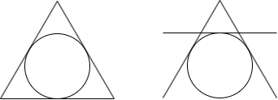
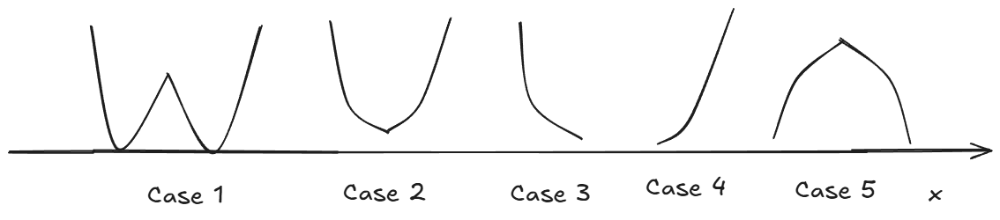
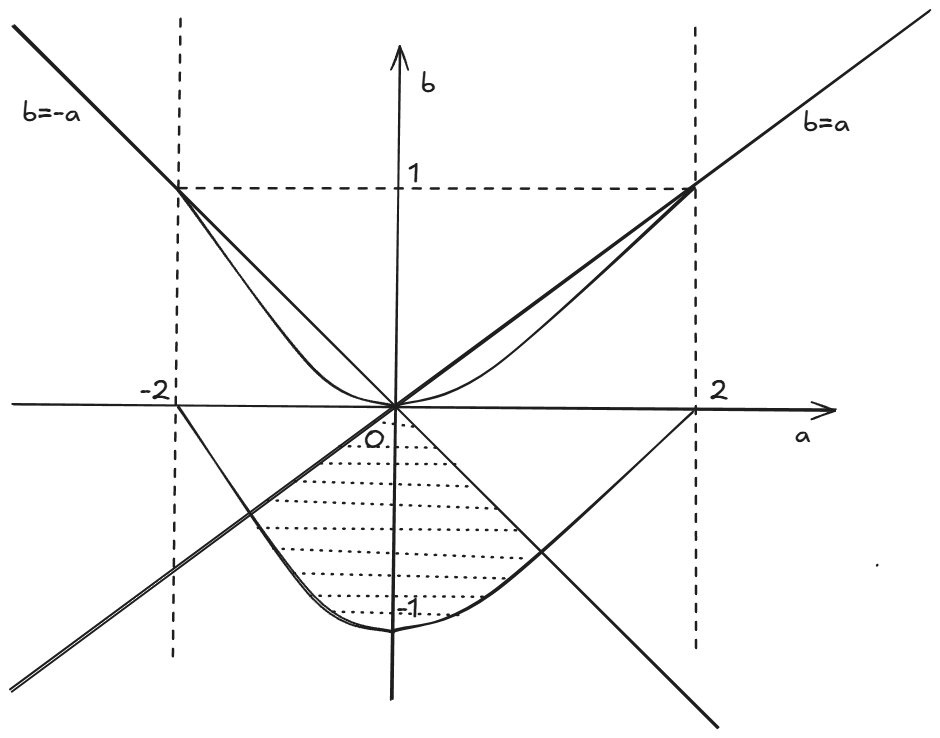

 <h1>集萃_1</h1> 

## 题1

​	定义：三维欧氏空间中的点称为整点，当且仅当x,y,z坐标都是整数，例如(1,1,2)，(-2,6,-2)。从空间中任取$n$个整点$P_1,P_2,P_3,...P_n$，再从它们之中任取两个不同的点$P_i,P_j(i \neq j)$，$P_i,P_j$的中点**不会**是整点。问：$n$的最大值为$\underline{}\underline{}\underline{}\underline{}\underline{}$

> 答案：8

**解析：**

​	 如果两个整点的中点还是整点，说明$x,y,z$坐标的奇偶性相同（因为奇加奇得偶，偶加偶得偶，而偶数除以二一定是整 数）。$x,y,z$的奇偶性一共能组合出$8$种情况：(奇，奇，奇)，(奇，偶，奇)，(偶，奇，奇)，(奇，奇，偶)，(奇，偶，偶)，(偶，偶，奇)，(偶，奇，偶)，(偶，偶，偶)。那么$n>8$时，也就是任取空间中至少$9$个整点时，其中必然存在两个整点的奇偶性相同，从而它们两个的中点也是整点。现在题目要求所有的中点都不能是整点，所以$n$最大为$8$(也就是取遍了所有奇偶性的组合)。

## 题2

​	平面直角坐标系中有三条直线: $l_1:\cos{\theta_1} \cdot x + \sin{\theta_1} \cdot y = 1,l_2:\cos{\theta_2} \cdot x + \sin{\theta_2} \cdot y = 1,l_3:\cos{\theta_3} \cdot x + \sin{\theta_3} \cdot y = 1 $，其中$\theta_1 \neq \theta_2 \neq \theta_3$。若$l_1,l_2,l_3$围成一个等边三角形，其面积为$S$，则$S$的取值集合为$\underline{}\underline{}\underline{}\underline{}\underline{}$

> 答案：{$\frac{\sqrt{3}}{3},3\sqrt{3}$}

**解析：**

​	观察三条直线的结构，容易注意到它们到原点的距离都为1。所以，它们都是单位圆的切线。又因为围成了等边三角形，所以有两种情形：要么单位圆作为等边三角形的内切圆，要么单位圆作为等边三角形的**外切圆**(注意不是外接圆)。如下图所示：

## 题3

​	任取一户有两个孩子的家庭，已知其中一个是女孩，则另一个是女孩的概率为$\underline{}\underline{}\underline{}\underline{}\underline{}$

> 答案：$\frac{1}{2}.....还是\frac{1}{3}$?

​	本题是一道争议很大的题目，被称为两孩悖论。在著名的概率论科普读物《醉汉的脚步》中，作者认为本题的答案是$\frac{1}{3}$，同时他还得到了一个更加违反常识的结论：如果把条件“已知其中一个是女孩”改为“已知其中一个是女孩，名字叫佛罗里达”，则结果变成$\frac{1}{2}$。

​	我知道，第一次看到上面的答案时，你会感到惊讶。实际上，上面的答案虽然有一定的道理，但也并不完全正确。迄今为止，包括《醉汉的脚步》作者蒙洛迪诺在内的很多人都对上面的答案提出了质疑。

​	我们先来看看蒙洛迪诺在书中写提出的解法：

 - 这是一个古典概型问题，考虑出生顺序，样本空间为{男，男}，{男，女}，{女，男}，{女，女}，现在已知有一个是女孩，那么{男，男}这种情况就不可能了，样本空间缩小为{女，女}，{男，女}，{女，男}，因此概率为$\frac{1}{3}$。
 - 如果把条件改成“已知其中一个是女孩，名字叫佛罗里达”，我们可以用女F表示叫佛罗里达的女孩，女NF表示不叫佛罗里达的女孩，这样样本空间就变成{男，男}，{女F，男}，{男，女F}，{女NF，男}，{男，女NF}，{女F，女NF}，{女NF，女F}，现在已知有一个叫佛罗里达的女孩，那么样本空间缩小为{女F，男}，{男，女F}，{女F，女NF}，{女NF，女F}，因此概率为$\frac{1}{2}$。

​	上面的解答看起来天衣无缝，但得到的结果非常违反直觉。到底错在哪？

​	严格来说，本题的题干是模糊不清的，因而对题干的不同理解，会导出不同的答案。

​	如果你认为本题的答案是$\frac{1}{2}$,你应该是这么想的：这是一个古典概型问题，不考虑出生顺序，样本空间为{男，男}，{男，女}，{女，女}，现在已知有一个是女孩，那么{男，男}这种情况就不可能了，样本空间变成{女，女}，{男，女}，因此概率为$\frac{1}{2}$。

​	问题在于样本空间上面，究竟要不要考虑出生的先后顺序？

​	在本题中，这个争议是解决不了的，因为本题的条件：“已知其中一个是女孩”叙述模糊，不管是从中文来理解，还是从英文原文来理解，都无从确定是否“特指”。

​	

## 题4

​	设$n$个随机事件$A_1,A_2,\cdot\cdot\cdot A_n$，发生的概率分别为$p_1,p_2,\cdot\cdot\cdot p_n$，满足$p_1+p_2+\cdot\cdot\cdot p_n = 1$，其中$p_1 \leq p_2 \leq \cdot\cdot\cdot p_n$，并且$p_i(i=1,2,\cdot\cdot\cdot n)$都是$\frac{1}{2}$的幂。

​	证明：$p_1=p_2$。

**解析：**

​	我们设
$$
p_i=(\frac{1}{2})^{k_i},(i=1,2,\cdot\cdot\cdot n)
$$
​	应有$k_1 \geq k_{2} \geq \cdot\cdot\cdot k_n$，我们要证明$k_1=k_2$。根据$p_1+p_2+\cdot\cdot\cdot p_n = 1$，有
$$
(\frac{1}{2})^{k_1} + (\frac{1}{2})^{k_2}+\cdot\cdot\cdot (\frac{1}{2})^{k_n}=1
$$
​	我们把它写成
$$
1+2^{k_1-k_2}+2^{k_1-k_3}+\cdot\cdot\cdot+2^{k_1-k_n}=2^{k_1}
$$
​	注意到右边是偶数，所以左边也是偶数。那么$2^{k_1-k_2}+2^{k_1-k_3}+\cdot\cdot\cdot+2^{k_1-k_n}$就应该是奇数，说明其中有指数为0的项（有奇数个，总之至少有一个）。因此至少我们知道$k_1-k_2$为0（因为它是最小的指数），从而 $k_1=k_2$ 。即 $p_1=p_2$。

**注：**这个问题看似单薄，实则背景深厚。所有概率均为$\frac{1}{2}$的幂，这样的情况非常特别，在很多地方都有应用。就我所知道的而言，计算机科学中的$Huffman$编码就是在这样的情况下，取到平均编码长度的下界。

## 题5

​	设$a,b \in \mathbb{R}$，若对于任意$x \in [-1,1]$，都有$|x^2+ax+b| \leq 1$，则$a$的取值范围是$\underline{}\underline{}\underline{}\underline{}\underline{}\underline{}\underline{}$

> 答案：$[2-2\sqrt{2},-2+2\sqrt{2}]$

**解析：**

​	这道题目可谓是把数学**“题干越短，题目越难”**的特点展现得淋漓尽致。没有接触过数学竞赛的正常高中生，如果能独立地做出这道题，可以说是非常非常不错的了。

​	曾经，浙江卷自主命题的时候，其一大特点就是层出不穷的绝对值。绝对值，这个数学概念看似简单，实则深奥无比，在绝对值上大做文章的难题比比皆是。

​	本题就是这样一道绝对值难题，它其实有一个背景，称为**“切比雪夫最佳逼近”**，只不过这个背景实在是过于深邃，没有一定竞赛基础的话很难真正弄懂，所以，我就以最通俗易懂的高中数学方法来解决这道题目。

​	设$f(x)=x^2+ax+b,x \in [-1,1]$，根据题目条件，$|f(x)|$的最大值为$1$。那么很自然的想到，要把$|f(x)|$的图像给画出来。

​	这是个什么样的函数？二次函数套绝对值，它在$[-1,1]$内的图像应该有$5$种情况：

​	我们先来考虑最复杂的**Case 1**:

​	要想出现这样的图像，说明$f(x)$的对称轴在 $[-1,1]$ 内，并且$f(x)$的最小值要小于$0$，把这两个条件转换成数学语言，就是：
$$
-1 < -\frac{a}{2} < 1 \quad \quad(1) \\
\quad\frac{4b-a^2}{4} < 0 \quad \quad(2)
$$
​	也就是
$$
-2 < a < 2 \\
b < \frac{a^2}{4}
$$
​	此时$|f(x)|$的最大值等于 $max\{f(-1),-f(-\frac{a}{2}),f(1)\}$ ，即
$$
max_{[-1,1]}|f(x)|=max\{f(-1),-f(-\frac{a}{2})，f(1)\}\\
\quad \quad \quad \quad \quad \quad \quad \quad \quad \quad \quad=max\{-a+b+1,\frac{a^2-4b}{4},a+b+1\}
$$
​	根据题意，上面这个最大值小于等于 $1$ ，说明
$$
-a+b+1 \leq 1 \\
\quad\frac{a^2-4b}{4} \leq 1 \\
\quad a+b+1 \leq 1
$$
​	化简上面的式子，并结合 $(1),(2)$ ，我们有
$$
b \leq a \quad \quad (3) \\
\quad \quad \quad b \geq \frac{a^2}{4}-1 \quad \quad(4) \\
\quad b \leq -a \quad \quad (5) \\
-2 < a < 2 \quad \quad (6) \\
\quad b \leq \frac{a^2}{4} \quad \quad (7) \\
$$
 	上面这个不等式组，已经指明了 $a,b$ 的范围。我们在平面直角坐标系中画出该不等式组表示的的区域：

​	

​	如图，点 $(a,b)$ 的范围用点线描绘了出来。它是由 $b=\frac{a^2}{2},b=\frac{a^2}{4}-1,b=a,b=-a$ 四条曲线/直线包围出来的区域，包括边界。因此 $2-2\sqrt{2}\leq a \leq 2\sqrt{2}-2$  。

​	对于其它 $4$ 种情况，做法是一样的，留给读者自行解决。

## 题6

（1）证明：不存在 $7$ 条棱的多面体。

（2）已知对于任意多面体，其面数 $\phi$  ，顶点数$\upsilon$ ，边数 $\varepsilon$ 满足：$\upsilon + \phi - \varepsilon = 2$ 。证明：正多面体的面数只能是 $4,6,8,12,20$ 。

**解析：**

  首先我们明确两个关系，在之后的解题中很有用：

>  设多面体的面数为 $\phi$ ，顶点数为 $\upsilon$ ，边数为$\varepsilon$ ，每个面上分别有 $m_1,m_2\cdot\cdot\cdot m_\phi$ 条边，每个顶点分别连出了 $n_1,n_2\cdot\cdot\cdot n_\upsilon$ 条边，则有:
> $$
> m_1+m_2+\cdot\cdot\cdot m_\phi=2\varepsilon\\
> n_1+n_2+\cdot\cdot\cdot n_\upsilon=2\varepsilon
> $$
> 这两个等式其实很显然，因为每条边都属于两个面，同时也属于两个顶点，因此每条边都被计算了两次。

（1）反证法。假设存在一个 $7$ 条棱的多面体，它的面数为 $\phi$ ，顶点数为 $\upsilon$ ，边数为 $\varepsilon = 7$ 。

​	因为每个面上至少有 $3$ 条边，所以 $3\phi \leq 2\upsilon = 14$ ，所以 $\phi \leq 4$，又因为 $\phi \geq 4$ （三个面不能构成多面体），故 $\phi = 4$ 。但是四面体的边数为 $6$ ，故假设不成立，也就是不存在 $7$ 条棱的多面体。

（2）设正多面体的面数为 $\phi$ ，顶点数为 $\upsilon$ ，边数为 $\varepsilon$ ，从每个顶点连出的边数为 $\delta$ ，每个面都是正 $n$ 边形，则：
$$
\upsilon + \phi - \varepsilon = 2 \\
n \cdot \phi = 2\varepsilon \\
\delta \cdot \upsilon = 2\varepsilon
$$
​	解得 
$$
(2n+2\delta - \delta n)\phi = 4\delta
$$
​	分下面几种情况讨论：

- $\delta = 3$ ，则 $(6-n)\phi = 12$
  - $n=3$ ，$\phi = 4$ ，即正四面体，每个面都是正三角形
  - $n=4$ ，$\phi=6$ ，即正六面体，每个面都是正四边形
  - $n=5$，$\phi=12$ ，即正十二面体，每个面都是正五边形 

- $\delta = 4$ ，则 $(8-2n)\phi=16$
  - $n=3$，$\phi=8$ ，即正八面体，每个面都是正三角形
- $\delta = 5$ ，则$(10-3n)\phi = 20$ 
  -  $n=3$，$\phi=20$ ，即正二十面体，每个面都是正三角形
- $\delta > 5$ ，这种情况是不成立的，留给读者作为练习。

​	**证毕！**

**注：**本题中的公式 $\upsilon + \phi - \varepsilon = 2$  称为**欧拉公式**。

## 题7

​	设
$$
P=\frac{a}{a+b}+\frac{b}{b+c}+\frac{c}{c+a}\quad a,b,c>0
$$
​	关于 $P$ ，下列说法中正确的是(    )

$A.$  $P$ 有最大值，无最小值

$B.$ $P$ 有最小值，无最大值

$C.$ $P$ 既有最大值又有最小值

$D.$ $P$ 既没有最大值又没有最小值

> 答案：$D$

**解析：**

​	这道题比较考验代数功底。

​	首先，$P$ 可以放缩为
$$
P > \frac{a}{a+b+c}+\frac{b}{a+b+c}+\frac{c}{a+b+c}=1
$$
​	那么 $P$ 有没有最小值呢？我们取 $a \to 0,b \to 0$ ，则 $P \to 1$ ，所以 $P$ 可以无限趋近于 $1$ ，没有最小值。

​	另一方面，$P$ 还可以放缩为
$$
P < \frac{a+c}{a+b+c}+\frac{b+a}{a+b+c}+\frac{c+b}{a+b+c}=2
$$
​	我们取 $a \to 0,b \to +\infty$ ，则 $P \to 2$ ，所以 $P$ 可以无限趋近于 $2$ ，没有最大值。

​	

## 题8

​	（2022-武汉四调）某同学在课外阅读时了解到概率统计中的切比雪夫不等式，该不等式可以使人们在随机变量 $X$ 的期望 $E(X)$ 和方差 $D(X)$ 存在但其分布未知的情况下，对事件 “$|X-E(X)|\geq \varepsilon$” 的概率作出上限估计，其中 $\varepsilon$ 为任意正实数。切比雪夫不等式的形式为： $P(|X-E(X)|\geq \varepsilon)\leq f(D(X),\varepsilon)$ ，其中 $f(D(X),\varepsilon)$ 是关于 $D(X)$ 和 $\varepsilon$ 的表达式。由于记忆模糊，该同学只能确定 $f(D(X),\varepsilon)$ 的具体形式是下列四个选项中的一种。请你根据所学相关知识，确定该形式是（    ）

$A.D(X)\cdot\varepsilon$      $B.\frac{1}{D(X)\cdot\varepsilon}$     $C.\frac{\varepsilon^2}{D(X)}$       $D.\frac{D(X)}{\varepsilon^2}$

> 答案：$D$

**解析：**

​	这道题目比较创新，解法也多种多样。一种比较简单的方法是使用**量纲**的思想。

​	所谓量纲，通俗来说就是单位：米、千克、秒、伏特......

​	物理公式（经验公式除外）都严格遵循量纲守恒，公式两边的量纲必须一致。其实，数学公式也是如此。

​	例如海伦公式：
$$
S=\sqrt{p(p-a)(p-b)(p-c)}
$$
​	左边的面积 $S$ 的量纲是 $2$ 次的（你可以想象成平方米），右边的量纲是 $4 \times \frac{1}{2}=2$ 次的，满足量纲守恒。不知道你发现没有，这个所谓的量纲守恒其实就是**齐次**。一般地，数学中的公式都是齐次的。

​	回到本题，切比雪夫不等式 $P(|X-E(X)|\geq \varepsilon)\leq f(D(X),\varepsilon)$ 的左边是概率，概率值是个常数，所以应该是 $0$ 次的，从而右边也应该是 $0$ 次的。观察四个选项，是 $0$ 次的只有 $C$ 和 $D$。（注意 $D(X)$ 是 $2$ 次，$\varepsilon$ 是 $0$ 次）

​	然后我们要在 $C$ 和 $D$ 中选。$|X-E(X)|\geq \varepsilon$ 这个不等式刻画了 $X$ 的**中心偏离程度**，而方差 $D(X)$ 越小，中心偏离程度应该越小，所以方差应该在分子上，故选 $D$ 。

## 题9

​	空间直角坐标系中，有一个棱长为 $4$ 的正四面体 $ABCD$ ，顶点 $A,B$ 分别在 $x$ 轴和 $y$ 轴上运动。设坐标原点为 $O$ ，正四面体 $ABCD$ 的中心为 $P$ ，则 $|PO|$ 的取值范围是 $\underline{}\underline{}\underline{}\underline{}\underline{}$

> 答案：$[2-\sqrt{2},2+\sqrt{2}]$

**解析：**

​	令人叹为观止的一道题。

​	$AB$ 在 $x$ 轴和 $y$ 轴上滑动的时候，相当于把坐标系看成参考系，正四面体围绕着坐标系运动。现在我们反过来想，把正四面体看成参考系，于是坐标系绕着正四面体运动，也就是 $O$ 在运动。注意到 $\angle AOB$ 始终为 $90\degree$ ，因此点 $O$ 的轨迹是以 $AB$ 为直径的球！后面就很简单了，留给读者作为练习。

​	
