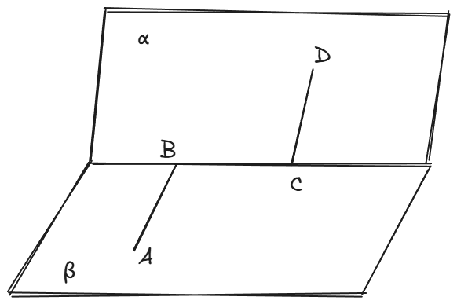
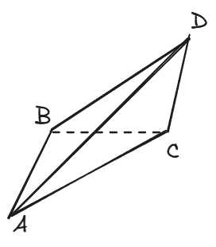
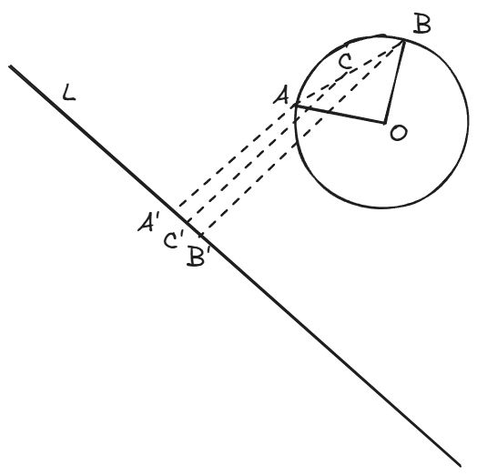
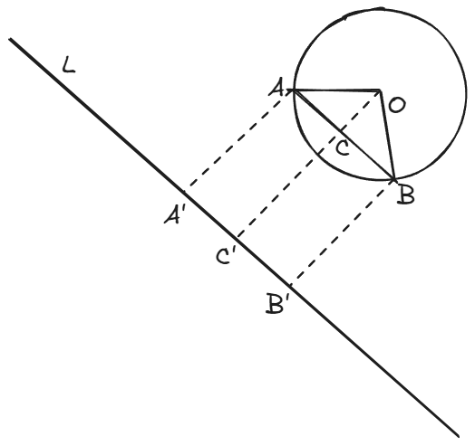
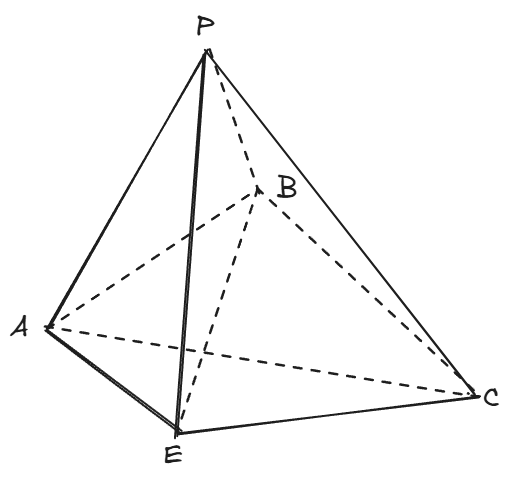

<h1>太中2023级高二上学期十月段考选讲</h1>

## 题5

已知四面体$ABCD$满足$AB\perp BC,BC \perp CD, AB = BC=CD=2\sqrt{3}, $且该四面体的体积为6，则异面直线$AD$与$BC$所成角的大小为(     )

$A. 45\degree$   $B.60\degree$  $C.45\degree$ 或 $60\degree$  $D.60\degree$ 或 $30\degree$   

> 答案：$C$

**解析：**

​	 大家在初学空间向量时，一定做过下面这道题：
 	$AB \perp BC \perp CD$，现已知$AB,BC,CD$的长度为1，$AB$与$CD$的夹角为$60\degree$，求$AD$与$BC$ 的夹角。
 

​	还记得这道题是怎么做的吗？我们把$\overrightarrow{AD}$用$\overrightarrow{AB}+\overrightarrow{BC}+\overrightarrow{CD}$来表示，然后利用$\cos{\theta}=\frac{\overrightarrow{AD}\cdot\overrightarrow{BC}}{|\overrightarrow{AD}||\overrightarrow{BC}|}$就能求出夹角。

​	对比一下这两题的题干，是不是有亿点相似？本题只不过是把已知$AB$与$CD$的夹角这个条件改为了已知四面体的体积，所以我们就要利用四面体的体积来求出$AB$与$CD$的夹角！首先我们画出本题的图：

​	

​	怎么利用体积这个条件呢？**这里我要介绍一个公式**。首先，我们知道三角形的面积公式有两种常用的形式，一种是$\frac{1}{2}$底$\times$高，一种是$\frac{1}{2}$边$\times$边$\times sin$夹角，而四面体是三角形在空间中的推广，它的很多公式在形式上跟三角形的公式都有对应，例如我们知道的体积公式为$\frac{1}{3}$底$\times$高，只是“底”的含义从底边变成底面积，而$\frac{1}{2}$也变成了$\frac{1}{3}$而已，这是很自然的，**因为维度从二维到了三维**。

​	那么，$\frac{1}{2}$边$\times$边$\times sin$夹角这个公式能不能对应四面体的一个体积公式呢？答案是肯定的，就是下面这个公式：
$$
V = \frac{2}{3a}S_1S_2\sin{\theta}
$$
​	其中，$V$是四面体的体积，$S_1,S_2$是两个相邻面的面积，$a$是这两个相邻面的公共边的长度，$\theta$是这两个相邻面的二面角的平面角。

​	例如在本题中，我们可以选取三角形$ABC$和三角形$BCD$的面积作为$S_1,S_2$，因而$BC$就是上面公式中的$a$，而$\theta$不正是我们想要求的$AB$与$CD$的夹角吗？后面就完全转化成之前说的那道题了~~

**注：**这道题还有一种方法，也就是把题目中的四面体嵌入一个正方体中（应该就是参考答案的方法），不过笔者认为，这种形状的四面体嵌入正方体并不常规，也不容易想到，故在这里就不做介绍了。当然无论如何，这道题目放在选择题的第5题都是不太合适的。

## 题8

已知圆$C:x^2+y^2=4$上的两点 $A(x_1,y_1),B(x_2,y_2)$满足$x_1x_2+y_1y_2=0$，则$|x_1+\sqrt{3}y_1+6|+|x_2+\sqrt{3}y_2+6|$的最小值为(   )

$A.6\sqrt{2}-4$     $B.12-4\sqrt{2}$   $C.6-2\sqrt{2}$   $D.3\sqrt{2}-2$

> 答案：$B$

**解析：**

​	这道题是**经典题型**，属于是学习直线与圆一定会做到的题目。

​	首先看条件$x_1x_2+y_1y_2=0$，它的含义是很明确的：$OA \perp OB$，因为$\overrightarrow{OA}\cdot\overrightarrow{OB}=x_1x_2+y_1y_2=0$。

​	再看要求的式子$|x_1+\sqrt{3}y_1+6|+|x_2+\sqrt{3}y_2+6|$。数学里面求一个表达式的最值无非两种方法：**代数法**和**几何法**。这个式子里面有两个变量，还有两个绝对值，这样的情况下代数分析**显然是非常困难的**，所以我们要找出这个式子的**几何含义**。

​	这里就要利用点到直线的距离公式了（也许你第一次做这个题目想不到这样做，但之后再遇到一定要反应过来）。我们设直线$l:x+\sqrt{3}y+6=0$，那么$\frac{|x_1+\sqrt{3}y_1+6|}{2}+\frac{|x_2+\sqrt{3}y_2+6|}{2}$就是点$A,B$到直线$l$的距离之和，而我们要求的式子$|x_1+\sqrt{3}y_1+6|+|x_2+\sqrt{3}y_2+6|$不就是上面这个距离之和的两倍吗？

​	

​	如上图所示，我们要求的就是$AA' + BB'$的最小值，我们取$AB$中点$C$（这么做的理由是：首先，在试错的过程中一般都会把$AB$连接起来，而三角形$OAB$是个等腰直角三角形，它斜边上的中点作为特殊点也是我们在寻找几何关系的时候应当着重考虑的地方），根据梯形的中位线，$AA'+BB'=2CC'$，所以我们只需要求$CC'$的最小值。容易知道当$AB \parallel l$时$CC'$最小。 

​	**注：**如果你不会求$CC'$的长度，可以求出$OO'$（也就是圆心到直线的距离），然后用$OO'-OC$就是$CC'$，不难发现此时$O'$和$C'$是重合的。

## 题19

如图，在三棱锥$P-ABC$中，$PB \perp$平面$ABC$，$AB = BC = BP = 2$，点$E$在平面$ABC$内，且满足平面$PAE\perp$平面$PBE$，$BA \perp BC$。

（1）当$\angle ABE \in [\frac{\pi}{8},\frac{\pi}{3}]$时，求点$E$的轨迹长度。

（2）当二面角$E-PA-B$的余弦值为$\frac{\sqrt{3}}{3}$时，求三棱锥$E-PCB$的体积。

​	

**解析：**

（1）本题的关键是如何利用条件"平面$PAE\perp$平面$PBE$"。这是所谓的**面面垂直**，一般地，在做题时遇到这种条件，要在一个面内找出一条直线垂直两个面的公共边，从而垂直于另一个面。

​	对于本题而言，我们可以过$B$点做$PE$的垂线，垂足为$Q$，从而$PQ \perp$平面$PAE$，也就和$AE$垂直了。另一方面$PB$也和$AE$垂直（因为$PB$垂直于底面），所以$AE$垂直于平面$PBE$了，从而$AE \perp BE$。结论已经得到，这个面面垂直的条件我们就用完了。

​	$E$是动点，刚才我们求出了$AE \perp BE$，那么$E$的轨迹是什么？很显然是一个以$AB$为直径的圆。根据$\angle ABE \in [\frac{\pi}{8},\frac{\pi}{3}]$我们可以画出$E$的轨迹图:

如上图所示，其中$\angle BAE_1 = 22.5\degree,\angle BAE_2 = 60\degree$，我们要求的轨迹就是圆弧$E_1E_2$，也就是要求出$\angle E_1OE_2$。计算$\angle BOE_2 = \angle BAE_2 + \angle AE_2O = 60\degree + 60\degree = 120\degree$，$\angle BOE_1 = \angle BAE_1 + \angle AE_1O = 22.5\degree + 22.5\degree = 45\degree$，从而$\angle E_1OE_2 = 120\degree - 45\degree = 75\degree = \frac{5\pi}{12}$。弧长$\overset{\LARGE{\frown}}{E_1E_2} = \frac{5\pi}{12} \times 1 = \frac{5\pi}{12}$。

（2）比较简单，直接设$E(a,b,0)$，计算即可。最后的方程除了根据条件“二面角$E-PA-B$的余弦值为$\frac{\sqrt{3}}{3}$”得到的方程，还有一个是$E$到$AB$中点$O$的距离为$1$（因为前面说了$E$的轨迹是以$AB$为直径的圆）。

